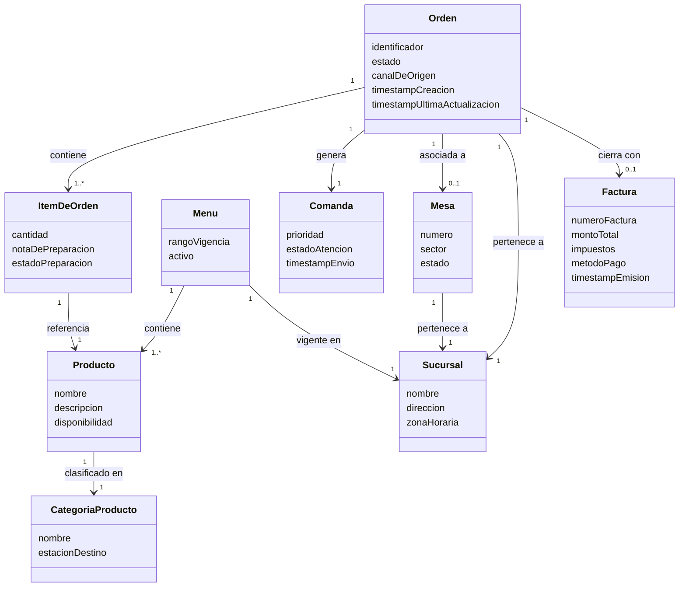

# Product Requirements Document (PRD)
## Sistema de Gestión de Órdenes — Cadena de Restaurantes
### Versión: 1.0 | Fecha: 2026-04-02

---

## 1. Visión General del Proyecto

### 1.1 Objetivo del Proyecto

Digitalizar y centralizar el proceso de gestión de órdenes de una cadena de restaurantes en crecimiento, eliminando los procesos manuales y fragmentados que generan retrasos en cocina y errores en las entregas. El sistema debe actuar como el núcleo operativo de la cadena, conectando los canales de recepción de pedidos con la cocina, la administración y el proceso de facturación.

### 1.2 Problema que Resuelve

| Problema Identificado | Impacto Actual |
|---|---|
| Procesos manuales y fragmentados | Retrasos en cocina, errores en entregas |
| Duplicación de información por el personal | Pérdida de tiempo y errores humanos |
| Ausencia de trazabilidad por orden | Sin visibilidad sobre el estado en tiempo real |
| Comunicación ineficiente con cocina | Comandas desordenadas, sin priorización |
| Cierre de cuenta manual | Desvinculación entre consumo y facturación |
| Sistema no preparado para escalar | Riesgo operativo en horas punta y crecimiento futuro |

### 1.3 Criterios de Éxito Medibles

| Criterio | Métrica de Éxito |
|---|---|
| Reducción de errores en entregas | Disminución >= 80% de órdenes con errores respecto al baseline manual |
| Tiempo de transmisión de comanda a cocina | < 5 segundos desde la confirmación del pedido |
| Disponibilidad del sistema | Uptime >= 99.9% (máximo 8.7 horas de caída al año) |
| Reducción de tiempos de cierre de cuenta | Reducción >= 50% en el tiempo de generación de factura |
| Visibilidad operativa | 100% de las órdenes activas visibles en panel administrativo con estado actualizado |
| Adopción del personal | >= 90% del personal operativo usando el sistema en los primeros 30 días |

### 1.4 Alcance

**Dentro del alcance (In-Scope) — Versión 1.0:**
- Recepción de órdenes desde mesas físicas (mesero) y canales digitales
- Gestión del ciclo de vida completo de una orden (Pendiente → En Preparación → Lista → Entregada)
- Comunicación en tiempo real con la estación de cocina
- Panel administrativo con visibilidad de estado de todas las órdenes activas
- Cierre de cuenta y generación de factura vinculada a la orden
- Gestión de menú (productos disponibles, precios, disponibilidad)
- Soporte multi-sucursal (la cadena opera en múltiples locales)

**Fuera del alcance (Out-of-Scope) — Versión 1.0:**
- Análisis avanzado de datos e inteligencia de inventario (reservado para versiones futuras)
- Optimización automática de tiempos de servicio mediante machine learning
- Sistema de reservas o gestión de mesas
- Gestión de proveedores o inventario de insumos
- Aplicación móvil para clientes finales (pedidos desde el móvil del comensal)
- Programa de fidelización o puntos

---

## 2. Stakeholders y Actores

### 2.1 Interesados (Stakeholders)

| Stakeholder | Rol | Interés Principal |
|---|---|---|
| Dueño de la cadena | Patrocinador / Decisor | Visibilidad operativa, escalabilidad, confiabilidad del sistema |
| Gerente de sucursal | Usuario administrador | Panel de control, reportes por sucursal, supervisión en tiempo real |
| Personal de sala (meseros) | Usuario operativo primario | Registrar órdenes de forma rápida y sin errores |
| Personal de cocina (cocineros) | Usuario operativo secundario | Recibir comandas organizadas y priorizadas |
| Personal de caja (cajeros) | Usuario operativo primario | Cierre de cuenta y emisión de factura vinculada |
| Clientes del restaurante | Beneficiario final | Recibir su pedido correctamente y en tiempo esperado |
| Canales digitales externos | Sistema externo | Enviar órdenes al sistema central |

### 2.2 Actores del Sistema

**Actores Primarios (interactúan directamente con el sistema):**
- **Mesero**: Registra órdenes desde mesa física, gestiona modificaciones y confirmaciones.
- **Cocinero**: Visualiza y actualiza el estado de las comandas en la estación de cocina.
- **Cajero**: Genera el cierre de cuenta y la factura.
- **Administrador de Sucursal**: Supervisa el panel de estado, gestiona el menú y configuraciones.

**Actores Secundarios (reciben salidas del sistema):**
- **Cliente**: Beneficiario final de la orden procesada correctamente.

**Actores Externos (sistemas que se integran):**
- **Canal Digital Externo**: Plataformas de delivery o pedidos en línea que envían órdenes al sistema.
- **Sistema de Facturación / Pasarela de Pagos**: Procesa el cobro y emite documentos fiscales.

### 2.3 Preferencias Registradas de los Interesados

> Nota: Las siguientes son preferencias tecnológicas expresadas por el equipo de desarrollo o por el contexto del proyecto. Se registran aquí como referencia para el Agente de Diseño. NO influyen en el análisis lógico de este documento.

| # | Preferencia | Fuente | Fase |
|---|---|---|---|
| P01 | Arquitectura robusta, escalable y confiable (no solo "toma de pedidos") | Dueño del restaurante | Diseño |
| P02 | Capacidad futura de analizar datos para inventario y tiempos de servicio | Dueño del restaurante | Fase 2+ |
| P03 | El sistema es parte de un microservicio (contexto del repositorio) | Contexto del proyecto | Diseño |

---

## 3. Glosario de Dominio (Lenguaje Ubicuo)

| Término | Definición | Sinónimos | Ejemplo |
|---|---|---|---|
| **Orden** | Solicitud formal de productos realizada por un cliente, asociada a una mesa o canal digital, con un ciclo de vida completo hasta su entrega y cobro. | Pedido, Comanda | "La Orden #42 de la Mesa 5 tiene 3 ítems." |
| **Ítem de Orden** | Unidad individual dentro de una orden, representando un producto del menú con cantidad, precio y notas especiales opcionales. | Línea de pedido | "2 unidades de Pizza Margarita sin champiñones." |
| **Comanda** | Representación de los ítems de una orden enviada a la estación de cocina para su preparación. Puede ser una vista parcial o total de la orden. | Ticket de cocina | "La Comanda de la Orden #42 fue enviada a Cocina Caliente." |
| **Mesa** | Espacio físico identificado dentro de una sucursal donde se atiende a uno o más clientes. | Table | "Mesa 5 del sector VIP de la Sucursal Centro." |
| **Sucursal** | Local físico perteneciente a la cadena de restaurantes donde opera el sistema. | Local, Sede | "Sucursal Centro", "Sucursal Norte." |
| **Menú** | Catálogo de productos ofrecidos en una sucursal, con sus precios y disponibilidad en un momento dado. | Carta | "El Menú del almuerzo activo para Sucursal Centro." |
| **Producto** | Elemento del menú que puede ser ordenado, con nombre, descripción, precio y categoría. | Plato, Ítem, Artículo | "Pizza Margarita, categoría: Pizzas, precio: $18,000." |
| **Categoría de Producto** | Agrupación lógica de productos que permite organizar el menú y filtrar comandas por estación de cocina. | — | "Pizzas", "Bebidas", "Entradas." |
| **Estado de Orden** | Etapa en el ciclo de vida de una orden. Define en qué fase se encuentra el procesamiento. | — | PENDIENTE, EN_PREPARACION, LISTA, ENTREGADA, CANCELADA |
| **Canal de Origen** | Medio por el cual se registró la orden en el sistema. | Fuente de pedido | MESA (mesero), DIGITAL (plataforma externa) |
| **Cierre de Cuenta** | Acción de finalizar una orden para proceder a su cobro, consolidando todos los ítems consumidos y calculando el total a pagar. | Facturación, Cobro | "El cajero realizó el cierre de cuenta de la Mesa 5." |
| **Factura** | Documento generado al cerrar una cuenta, que detalla los productos consumidos, precios, impuestos y total. | Ticket, Recibo, Boleta | "Factura #F-2026-00123 por $54,000." |
| **Nota de Preparación** | Instrucción especial asociada a un ítem de orden que debe comunicarse a cocina. | Notas especiales | "Sin cebolla", "término tres cuartos." |
| **Prioridad de Comanda** | Nivel de urgencia asignado a una comanda que determina su posición de atención en la cola de cocina. | — | NORMAL, URGENTE |
| **Panel Administrativo** | Interfaz de supervisión que muestra el estado en tiempo real de todas las órdenes activas en una sucursal. | Dashboard | "El gerente visualiza las 12 órdenes activas en el panel." |
| **Estación de Cocina** | División funcional dentro de cocina que atiende un tipo específico de productos. | Puesto de cocina | "Cocina Caliente", "Cocina Fría", "Barra." |

---

## 4. Modelo de Dominio Conceptual

### 4.1 Entidades y Value Objects

**Entidades (tienen identidad propia):**

| Entidad | Descripción | Atributos Clave (lógicos) |
|---|---|---|
| **Orden** | Núcleo del dominio. Representa el pedido completo de un cliente. | identificador, estado, canal de origen, timestamps de ciclo de vida |
| **Ítem de Orden** | Componente de una orden, representa un producto solicitado. | cantidad, notas de preparación, estado de preparación propio |
| **Producto** | Elemento del menú que puede ser ordenado. | nombre, descripción, categoría, disponibilidad |
| **Menú** | Catálogo vigente de una sucursal en un período. | fecha de vigencia, sucursal asociada |
| **Mesa** | Espacio físico de atención en una sucursal. | número/identificador, sector, capacidad, estado (libre/ocupada) |
| **Sucursal** | Local operativo de la cadena. | nombre, dirección, zona horaria |
| **Factura** | Documento de cierre económico de una orden. | número de factura, totales, impuestos, método de pago |
| **Comanda** | Representación de la orden o parte de ella enviada a cocina. | prioridad, estación de destino, estado de atención |

**Value Objects (sin identidad, inmutables):**

| Value Object | Descripción |
|---|---|
| **MontoTotal** | Valor monetario total de una orden o factura (monto + moneda). |
| **PrecioUnitario** | Precio de un producto en un momento dado del menú. |
| **NotaDePreparacion** | Texto libre con instrucciones especiales para cocina, validado por longitud. |
| **DireccionSucursal** | Datos de ubicación de una sucursal (calle, ciudad, país). |
| **RangoFechaVigencia** | Período de validez de un menú (fecha inicio, fecha fin). |
| **Timestamp** | Marca de tiempo de cada transición de estado de una orden. |

### 4.2 Aggregates Identificados

| Aggregate Root | Entidades incluidas | Razón |
|---|---|---|
| **Orden** | Orden + ítems de orden + comanda | La Orden es la frontera de consistencia: ningún ítem ni comanda tiene sentido fuera de ella |
| **Menú** | Menú + Productos + Categorías | La disponibilidad y precio de un producto solo tienen sentido dentro del contexto de un menú activo |
| **Sucursal** | Sucursal + Mesas | Las mesas pertenecen a una sucursal y su estado es gestionado en ese contexto |
| **Factura** | Factura (resultado del cierre) | Es el artefacto de cierre económico, generado a partir de la Orden pero con ciclo de vida propio |

### 4.3 Relaciones Lógicas entre Entidades



---

## 5. Requisitos Funcionales

### 5.1 Casos de Uso

---

#### CU-01: Registrar Orden desde Mesa

**Actor principal:** Mesero
**Precondición:** El mesero tiene acceso al sistema y la mesa está activa.

**Flujo Principal:**
1. El mesero selecciona la mesa desde el sistema.
2. El sistema muestra el menú activo de la sucursal.
3. El mesero agrega ítems al pedido (producto, cantidad, notas especiales opcionales).
4. El mesero confirma la orden.
5. El sistema valida que todos los productos estén disponibles.
6. El sistema registra la orden con estado PENDIENTE y canal MESA.
7. El sistema genera la comanda y la envía a la estación de cocina correspondiente.
8. El sistema notifica visualmente la confirmación al mesero.

**Flujos Alternativos:**
- **FA-01a**: Si un producto ya no está disponible, el sistema alerta al mesero antes de confirmar y le propone remover ese ítem.
- **FA-01b**: El mesero puede modificar la cantidad de un ítem antes de confirmar.
- **FA-01c**: El mesero puede agregar notas especiales a un ítem (hasta el momento en que la comanda sea aceptada por cocina).

**Flujos de Excepción:**
- **FE-01a**: Si el sistema pierde conectividad, debe mostrar un mensaje claro y conservar el pedido en estado borrador hasta restaurar la conexión.

---

#### CU-02: Recibir Orden desde Canal Digital

**Actor principal:** Canal Digital Externo (sistema externo)
**Precondición:** El canal externo está integrado y autenticado.

**Flujo Principal:**
1. El canal digital envía la orden al sistema con los ítems, origen y datos del pedido.
2. El sistema valida la estructura y disponibilidad de los productos.
3. El sistema registra la orden con estado PENDIENTE y canal DIGITAL.
4. El sistema genera la comanda y la envía a cocina.
5. El sistema confirma la recepción al canal externo.

**Flujos de Excepción:**
- **FE-02a**: Si hay productos no disponibles o la estructura es inválida, el sistema rechaza la orden y notifica al canal externo con el motivo.

---

#### CU-03: Gestionar Comanda en Cocina

**Actor principal:** Cocinero
**Precondición:** Hay comandas en estado pendiente asignadas a la estación del cocinero.

**Flujo Principal:**
1. El sistema muestra las comandas ordenadas por prioridad en la pantalla de cocina.
2. El cocinero visualiza los ítems de cada comanda.
3. El cocinero acepta una comanda: el sistema actualiza la orden a EN_PREPARACION.
4. El cocinero marca la comanda como completada: el sistema actualiza la orden a LISTA.
5. El sistema notifica al mesero que la orden está lista para ser entregada.

**Flujos Alternativos:**
- **FA-03a**: El cocinero puede marcar ítems individuales como listos cuando la comanda tiene múltiples ítems de distinta complejidad.
- **FA-03b**: El cocinero puede elevar la prioridad de una comanda a URGENTE.

**Flujos de Excepción:**
- **FE-03a**: Si un ingrediente se agota, el cocinero puede rechazar un ítem específico y el sistema notifica al mesero para que informe al cliente.

---

#### CU-04: Actualizar Estado de Orden (Entrega)

**Actor principal:** Mesero
**Precondición:** La orden está en estado LISTA.

**Flujo Principal:**
1. El mesero recibe la notificación de orden lista.
2. El mesero entrega los platos a la mesa.
3. El mesero confirma la entrega en el sistema.
4. El sistema actualiza la orden a ENTREGADA.

---

#### CU-05: Cancelar Orden

**Actor principal:** Mesero o Administrador de Sucursal
**Precondición:** La orden está en estado PENDIENTE o EN_PREPARACION.

**Flujo Principal:**
1. El actor solicita la cancelación de la orden indicando un motivo.
2. El sistema valida que la orden sea cancelable (no puede estar en LISTA o ENTREGADA).
3. El sistema actualiza el estado a CANCELADA y registra el motivo y el actor.
4. Si la comanda ya fue enviada a cocina, el sistema notifica a cocina sobre la cancelación.

**Flujos de Excepción:**
- **FE-05a**: Si la orden ya está en estado LISTA o ENTREGADA, el sistema rechaza la cancelación y el administrador debe gestionar el caso manualmente.

---

#### CU-06: Cerrar Cuenta y Generar Factura

**Actor principal:** Cajero
**Precondición:** La orden está en estado ENTREGADA.

**Flujo Principal:**
1. El cajero solicita el cierre de cuenta de una orden/mesa específica.
2. El sistema consolida todos los ítems entregados con sus precios y calcula subtotal, impuestos y total.
3. El cajero confirma el monto y registra el método de pago.
4. El sistema integra con el sistema de facturación externo para emitir la factura.
5. El sistema marca la orden como cerrada y libera la mesa.
6. El sistema entrega al cajero el número de factura generado.

**Flujos Alternativos:**
- **FA-06a**: El cajero puede dividir la cuenta entre múltiples métodos de pago.
- **FA-06b**: Si la sucursal permite descuentos, el administrador puede aplicar uno antes del cierre.

**Flujos de Excepción:**
- **FE-06a**: Si el sistema de facturación externo no responde, el sistema conserva el intento de cierre en estado pendiente y reintenta automáticamente.

---

#### CU-07: Supervisar Panel Administrativo

**Actor principal:** Administrador de Sucursal / Dueño
**Precondición:** El actor tiene acceso al panel administrativo.

**Flujo Principal:**
1. El administrador accede al panel de su sucursal.
2. El sistema muestra todas las órdenes activas agrupadas por estado.
3. El administrador puede filtrar por estado, canal de origen, o mesa.
4. El sistema actualiza el panel en tiempo real sin necesidad de recarga manual.

---

#### CU-08: Gestionar Menú

**Actor principal:** Administrador de Sucursal
**Precondición:** El administrador tiene permisos sobre el menú.

**Flujo Principal:**
1. El administrador accede a la gestión de menú.
2. El administrador puede: agregar productos, modificar precios, cambiar disponibilidad (activar/desactivar productos).
3. El sistema aplica los cambios de forma inmediata sobre las nuevas órdenes.
4. Los cambios de precio no afectan órdenes ya registradas.

**Regla de negocio aplicable:** RN-04.

---

### 5.2 User Stories

---

**US-01: Registrar orden desde mesa**

```
COMO mesero
QUIERO registrar una nueva orden seleccionando productos del menú activo
PARA que la cocina reciba la comanda inmediatamente y sin errores de transcripción

Criterios de Aceptación:
- DADO que el mesero ha seleccionado una mesa activa
  CUANDO agrega ítems y confirma la orden
  ENTONCES el sistema registra la orden en estado PENDIENTE y envía la comanda a cocina en menos de 5 segundos

- DADO que un producto está marcado como no disponible en el menú
  CUANDO el mesero intenta agregarlo a la orden
  ENTONCES el sistema alerta al mesero antes de la confirmación y no permite incluir ese ítem
```

---

**US-02: Recibir orden de canal digital**

```
COMO sistema externo (canal digital)
QUIERO enviar órdenes al sistema central de gestión
PARA que sean procesadas por cocina con la misma prioridad que las órdenes de mesa

Criterios de Aceptación:
- DADO que el canal digital envía una orden con estructura válida y productos disponibles
  CUANDO el sistema la recibe
  ENTONCES la registra en estado PENDIENTE, canal DIGITAL, y la comanda aparece en cocina en menos de 5 segundos

- DADO que el canal digital envía una orden con un producto no disponible
  CUANDO el sistema intenta registrarla
  ENTONCES rechaza la orden y responde al canal externo con el motivo del rechazo
```

---

**US-03: Visualizar y gestionar comandas en cocina**

```
COMO cocinero
QUIERO ver las comandas organizadas por prioridad en mi estación
PARA preparar los pedidos en el orden correcto y sin perder ninguna solicitud

Criterios de Aceptación:
- DADO que existen comandas nuevas asignadas a mi estación
  CUANDO accedo a la pantalla de cocina
  ENTONCES veo las comandas ordenadas por prioridad (URGENTE primero) con todos sus ítems y notas de preparación visibles

- DADO que marco una comanda como completada
  CUANDO confirmo la acción
  ENTONCES el estado de la orden cambia a LISTA y el mesero recibe una notificación instantánea
```

---

**US-04: Notificación de orden lista al mesero**

```
COMO mesero
QUIERO recibir una notificación en tiempo real cuando una orden está lista en cocina
PARA entregar el pedido al cliente sin demoras

Criterios de Aceptación:
- DADO que el cocinero marcó una comanda como completada
  CUANDO se genera el evento de orden LISTA
  ENTONCES el mesero responsable de esa mesa recibe una notificación en su dispositivo en menos de 3 segundos

- DADO que el mesero confirma la entrega al cliente
  CUANDO registra la acción en el sistema
  ENTONCES la orden pasa a estado ENTREGADA y la mesa queda disponible para cierre de cuenta
```

---

**US-05: Cerrar cuenta y generar factura**

```
COMO cajero
QUIERO generar el cierre de cuenta de una mesa con la lista exacta de lo que fue ordenado y entregado
PARA emitir la factura correcta sin discrepancias con el cliente

Criterios de Aceptación:
- DADO que la orden está en estado ENTREGADA
  CUANDO el cajero solicita el cierre de cuenta
  ENTONCES el sistema muestra el desglose de ítems con precios, subtotal, impuestos y total calculado correctamente

- DADO que el cajero confirma el pago
  CUANDO el sistema de facturación externo procesa la solicitud
  ENTONCES se genera la factura con número único, la mesa queda libre y la orden pasa a estado cerrado
```

---

**US-06: Supervisar órdenes en panel administrativo**

```
COMO administrador de sucursal
QUIERO ver en tiempo real el estado de todas las órdenes activas de mi sucursal
PARA detectar cuellos de botella y tomar decisiones operativas a tiempo

Criterios de Aceptación:
- DADO que el administrador accede al panel
  CUANDO hay órdenes activas en cualquier estado
  ENTONCES el sistema las muestra agrupadas por estado con tiempo transcurrido desde su creación, actualizándose automáticamente sin recargar la página

- DADO que el administrador aplica un filtro (por estado, mesa o canal)
  CUANDO selecciona el criterio
  ENTONCES el panel muestra solo las órdenes que cumplen ese criterio
```

---

**US-07: Cancelar orden con notificación a cocina**

```
COMO mesero o administrador de sucursal
QUIERO cancelar una orden activa indicando el motivo
PARA que cocina deje de preparar ítems innecesarios y se registre la cancelación

Criterios de Aceptación:
- DADO que la orden está en estado PENDIENTE o EN_PREPARACION
  CUANDO el actor solicita la cancelación con un motivo
  ENTONCES el sistema actualiza el estado a CANCELADA, notifica a cocina y registra el motivo y el responsable

- DADO que la orden está en estado LISTA o ENTREGADA
  CUANDO el actor intenta cancelarla
  ENTONCES el sistema rechaza la acción y muestra un mensaje indicando que debe contactar al administrador
```

---

**US-08: Gestionar disponibilidad del menú**

```
COMO administrador de sucursal
QUIERO activar o desactivar productos del menú y actualizar precios
PARA que el sistema refleje la disponibilidad real en tiempo real

Criterios de Aceptación:
- DADO que el administrador desactiva un producto
  CUANDO el mesero intenta agregarlo a una nueva orden
  ENTONCES el producto no aparece como disponible y no puede ser seleccionado

- DADO que el administrador actualiza el precio de un producto
  CUANDO se registra un nuevo pedido después del cambio
  ENTONCES el nuevo precio aplica solo a las órdenes creadas desde ese momento en adelante
```

---

### 5.3 User Journeys

#### Journey 1: Flujo completo de una orden de mesa (Happy Path)

```
[Mesero] Selecciona mesa
    |
    v
[Sistema] Muestra menú activo
    |
    v
[Mesero] Agrega ítems + notas especiales
    |
    v
[Mesero] Confirma orden
    |
    v
[Sistema] Registra Orden (PENDIENTE) → Envía Comanda a Cocina (< 5 seg)
    |
    v
[Cocinero] Ve comanda en pantalla de cocina → Acepta comanda
    |
    v
[Sistema] Actualiza Orden → EN_PREPARACION
    |
    v
[Cocinero] Termina preparación → Marca como completada
    |
    v
[Sistema] Actualiza Orden → LISTA → Notifica a Mesero (< 3 seg)
    |
    v
[Mesero] Entrega platos → Confirma entrega en sistema
    |
    v
[Sistema] Actualiza Orden → ENTREGADA
    |
    v
[Cajero] Solicita cierre de cuenta → Confirma pago
    |
    v
[Sistema] Genera Factura → Mesa liberada → Orden CERRADA
```

#### Journey 2: Orden desde canal digital

```
[Canal Digital] Envía orden al sistema
    |
    v
[Sistema] Valida estructura y disponibilidad
    |--- INVÁLIDA ---> Rechaza con motivo → FIN
    |
    v
[Sistema] Registra Orden (PENDIENTE, canal DIGITAL) → Confirma al canal
    |
    v
[Sistema] Envía Comanda a Cocina (< 5 seg)
    |
    v
[Continúa igual que Journey 1 desde el paso del Cocinero]
```

#### Journey 3: Producto no disponible durante preparación

```
[Cocinero] Detecta ingrediente agotado para un ítem
    |
    v
[Cocinero] Rechaza ítem específico en el sistema
    |
    v
[Sistema] Notifica al Mesero → "Ítem X no disponible en Orden #N"
    |
    v
[Mesero] Informa al cliente → Decide si reemplaza o cancela ítem
    |
    v
[Mesero] Actualiza la orden (reemplazo o remoción del ítem)
    |
    v
[Sistema] Envía comanda actualizada a cocina
```

---

## 6. Requisitos No Funcionales

| ID | Categoría | Requisito | Métrica |
|---|---|---|---|
| RNF-01 | Rendimiento | El sistema debe registrar una orden y enviar la comanda a cocina en tiempo total menor a 5 segundos desde la confirmación del usuario. | Latencia p95 < 5s |
| RNF-02 | Rendimiento | El panel administrativo debe actualizarse con cambios de estado en tiempo real, con un retraso máximo de 3 segundos. | Latencia de actualización < 3s |
| RNF-03 | Disponibilidad | El sistema debe estar disponible el 99.9% del tiempo (máximo 8.7 horas de caída por año). | Uptime >= 99.9% |
| RNF-04 | Escalabilidad | El sistema debe soportar la operación concurrente de múltiples sucursales sin degradación de rendimiento. | Sin degradación con N sucursales activas simultáneamente |
| RNF-05 | Escalabilidad | El sistema debe soportar picos de carga en horas punta sin pérdida de órdenes ni retrasos perceptibles. | Capacidad de absorber picos 3x el tráfico promedio |
| RNF-06 | Seguridad | El acceso al sistema debe requerir autenticación. Cada actor debe tener acceso solo a las funciones de su rol. | Control de acceso basado en roles (RBAC) |
| RNF-07 | Seguridad | Las comunicaciones entre componentes del sistema y con sistemas externos deben ser cifradas. | Cifrado en tránsito |
| RNF-08 | Usabilidad | La interfaz de los meseros y cocineros debe ser operativa con un entrenamiento máximo de 2 horas. | Tiempo de onboarding <= 2 horas |
| RNF-09 | Usabilidad | Las pantallas de cocina deben ser legibles a distancia y operable con guantes o pantalla táctil. | Diseño optimizado para pantalla táctil en entorno de cocina |
| RNF-10 | Trazabilidad | Toda transición de estado de una orden debe quedar registrada con actor responsable y timestamp. | Audit log inmutable por orden |
| RNF-11 | Confiabilidad | Ante fallo del sistema de facturación externo, el sistema no debe perder el intento de cierre. | Persistencia del estado de cierre pendiente con reintento automático |
| RNF-12 | Internacionalización | El sistema debe soportar múltiples zonas horarias para cadenas con sucursales en distintas ciudades. | Timestamps almacenados en UTC, visualizados en zona horaria de la sucursal |

---

## 7. Reglas de Negocio

| ID | Regla | Fuente | Tipo | Impacto | Prioridad |
|---|---|---|---|---|---|
| RN-01 | Una orden no puede tener ítems de productos que estén marcados como no disponibles al momento de la confirmación. | Operación del negocio | Validación | Impide registro de órdenes con productos no disponibles | Must |
| RN-02 | Solo se puede cancelar una orden que esté en estado PENDIENTE o EN_PREPARACION. Las órdenes LISTAS o ENTREGADAS no son cancelables por flujo normal. | Operación del negocio | Estado | Protege la integridad del ciclo de vida | Must |
| RN-03 | El cierre de cuenta solo puede realizarse sobre una orden en estado ENTREGADA. | Operación del negocio | Estado | Garantiza que no se factura lo que no fue entregado | Must |
| RN-04 | Un cambio de precio en el menú aplica únicamente a órdenes registradas después del cambio. Las órdenes ya registradas conservan el precio al momento de su creación. | Operación del negocio | Integridad | Protege al cliente y la coherencia contable | Must |
| RN-05 | Una mesa que tiene una orden activa (PENDIENTE, EN_PREPARACION, LISTA o ENTREGADA) no puede ser asignada a una nueva orden hasta que la orden actual sea cerrada. | Operación del negocio | Validación | Evita órdenes duplicadas en la misma mesa | Must |
| RN-06 | Toda cancelación de orden debe registrar el motivo de cancelación y el actor que la ejecutó. | Auditoría interna | Trazabilidad | Soporte a análisis de operaciones y control interno | Should |
| RN-07 | Las comandas deben enviarse a la estación de cocina correspondiente según la categoría del producto (ej: productos de parrilla a Cocina Caliente, bebidas a Barra). | Operación del negocio | Enrutamiento | Reduce errores de preparación y mejora eficiencia en cocina | Must |
| RN-08 | Una orden debe contener al menos un ítem para poder ser confirmada. | Validación | Integridad | Impide órdenes vacías | Must |
| RN-09 | Los precios de los ítems en la factura deben coincidir exactamente con los precios vigentes en el momento de la creación de la orden. | Legal/Contable | Integridad contable | Obligación legal de exactitud en documentos fiscales | Must |
| RN-10 | El acceso al panel administrativo está restringido a perfiles con rol de Administrador de Sucursal o Dueño. | Seguridad interna | Control de acceso | Protección de información operativa y comercial sensible | Must |

---

## 8. Restricciones

### 8.1 Legales y Regulatorias

| ID | Restricción | Descripción |
|---|---|---|
| RC-01 | Facturación electrónica | Las facturas generadas deben cumplir con las regulaciones fiscales locales aplicables (formato, datos obligatorios, numeración consecutiva). El Agente de Diseño debe considerar la normativa del país de operación. |
| RC-02 | Protección de datos del cliente | Si el sistema almacena datos de clientes (pedidos por cuenta, historial), debe cumplir con la normativa de protección de datos vigente en el país de operación. |
| RC-03 | Integridad contable | Los registros de órdenes y facturas deben ser inmutables una vez cerrados, para garantizar trazabilidad contable. |

### 8.2 De Negocio

| ID | Restricción | Descripción |
|---|---|---|
| RB-01 | Operación multi-sucursal | El sistema debe soportar la operación de múltiples sucursales desde su primera versión, dada la naturaleza de cadena del cliente. |
| RB-02 | Continuidad en horas punta | El sistema no puede tener ventanas de mantenimiento planificadas durante horas de servicio de los restaurantes. |
| RB-03 | Evolución futura | La arquitectura debe estar diseñada para incorporar módulos de analítica e inventario en fases posteriores sin rediseño fundamental. |
| RB-04 | Sin dependencia de un único canal | El sistema debe funcionar correctamente aunque algún canal digital externo no esté disponible. |

### 8.3 Preferencias Tecnológicas del Interesado (Registradas, No Vinculantes)

| ID | Preferencia | Expresada por | Decisión Final |
|---|---|---|---|
| PT-01 | Arquitectura "robusta, escalable y confiable" — contexto del repositorio sugiere microservicio con arquitectura hexagonal | Dueño del restaurante / Contexto del proyecto | A definir por Agente de Diseño |
| PT-02 | Capacidad de análisis de datos a futuro (inventario, tiempos de servicio) | Dueño del restaurante | Considerar en diseño de modelo de datos para extensibilidad |
| PT-03 | Comunicación en tiempo real para cocina y notificaciones | Dueño del restaurante | A definir por Agente de Diseño (WebSockets, SSE, mensajería) |

---

## 9. Matriz de Priorización MoSCoW

| ID | Requisito | Categoría MoSCoW | Justificación |
|---|---|---|---|
| R-01 | Registrar órdenes desde mesa (CU-01 / US-01) | **Must** | Core del negocio. Sin esto el sistema no tiene valor. |
| R-02 | Recibir órdenes desde canal digital (CU-02 / US-02) | **Must** | El cliente explicitó centralizar todos los canales desde el inicio. |
| R-03 | Envío de comanda a cocina en tiempo real (CU-03) | **Must** | Resuelve el problema principal de comunicación con cocina. |
| R-04 | Gestión de estados de orden (PENDIENTE→ENTREGADA) (CU-04) | **Must** | La trazabilidad es un requisito explícito del cliente. |
| R-05 | Notificación en tiempo real al mesero (orden lista) (US-04) | **Must** | Sin esto, la cocina y sala no están sincronizadas. |
| R-06 | Cierre de cuenta y generación de factura (CU-06 / US-05) | **Must** | Flujo de negocio obligatorio. El sistema sin cobro no cierra el ciclo. |
| R-07 | Panel administrativo en tiempo real (CU-07 / US-06) | **Must** | Requisito explícito del dueño. Es su herramienta de supervisión central. |
| R-08 | Gestión del menú (CU-08 / US-08) | **Must** | Sin menú gestionable, el sistema no puede operar. |
| R-09 | Cancelación de orden con notificación a cocina (CU-05 / US-07) | **Must** | Impacta directamente en el desperdicio de recursos de cocina. |
| R-10 | Soporte multi-sucursal | **Must** | La naturaleza de cadena hace esto obligatorio desde v1.0. |
| R-11 | Control de acceso por rol (RBAC) | **Must** | Seguridad básica operativa y protección de datos contables. |
| R-12 | Enrutamiento de comandas por categoría/estación | **Should** | Mejora la eficiencia operativa en cocina. No crítico para el lanzamiento si las cocinas son pequeñas, pero muy valioso. |
| R-13 | Priorización de comandas (NORMAL / URGENTE) | **Should** | Importante para operación eficiente pero el sistema puede funcionar inicialmente con FIFO. |
| R-14 | División de cuenta entre múltiples métodos de pago | **Should** | Mejora la experiencia del cajero. No bloquea el lanzamiento. |
| R-15 | Descuentos en cierre de cuenta | **Could** | Deseable para promociones, pero no es parte del flujo core. |
| R-16 | Estadísticas y análisis de datos (inventario, tiempos) | **Won't** | Explícitamente fuera de alcance en v1.0. Reservado para fases futuras. |
| R-17 | Aplicación móvil para clientes finales | **Won't** | Fuera de alcance en v1.0. |
| R-18 | Gestión de reservas o mesas | **Won't** | Fuera de alcance. Sistema distinto con dominio propio. |
| R-19 | Gestión de proveedores e inventario de insumos | **Won't** | Fuera de alcance en v1.0. |

---

## 10. Riesgos Identificados

| ID | Riesgo | Probabilidad | Impacto | Estrategia de Mitigación |
|---|---|---|---|---|
| RG-01 | Resistencia del personal al cambio de proceso manual a digital | Alta | Alto | Plan de capacitación estructurado; interfaz diseñada para usabilidad extrema; piloto en una sucursal antes del rollout general |
| RG-02 | Indisponibilidad del sistema de facturación externo en horas punta | Media | Alto | Implementar mecanismo de cola persistente con reintento automático; permitir continuar operando aunque la factura se genere diferida |
| RG-03 | Pérdida de conectividad en la red del restaurante | Media | Alto | Definir comportamiento offline mínimo (modo borrador de órdenes); alertas claras al usuario |
| RG-04 | Ambigüedad en la integración con canales digitales externos | Alta | Medio | Definir contrato de API en fases tempranas de diseño; involucrar a los proveedores de canales digitales antes del desarrollo |
| RG-05 | Escalabilidad insuficiente en horas punta (fallas bajo carga) | Baja | Muy Alto | El diseño debe contemplar concurrencia desde el inicio; pruebas de carga previas al lanzamiento |
| RG-06 | Cambios en regulación de facturación electrónica durante el desarrollo | Media | Medio | Desacoplar el módulo de facturación como integración externa; mantener el core del sistema independiente de la normativa |
| RG-07 | Alcance mal definido en la integración con canales digitales (número de canales, formato) | Alta | Medio | Levantar con el cliente la lista exacta de canales digitales actuales y futuros antes del diseño técnico |
| RG-08 | Multi-sucursal con diferencias de menú o configuración entre locales | Media | Medio | Diseñar desde el inicio con aislamiento de configuración por sucursal |

---

## 11. Criterios de Aceptación del Proyecto (Requisitos Analysis Phase)

Las siguientes condiciones deben cumplirse para considerar la fase de análisis de requisitos completa y lista para el handoff al Agente de Diseño:

- [x] Todos los actores identificados con sus responsabilidades definidas.
- [x] Ciclo de vida completo de la Orden modelado con todos sus estados.
- [x] Todos los casos de uso principales documentados con flujos alternativos y de excepción.
- [x] User Stories con al menos 2 criterios de aceptación cada una.
- [x] Glosario de dominio completo (lenguaje ubicuo establecido).
- [x] Todas las entidades del dominio identificadas y relacionadas.
- [x] Aggregates definidos con sus fronteras de consistencia.
- [x] Reglas de negocio separadas de restricciones técnicas.
- [x] MoSCoW aplicado a todos los requisitos con justificación.
- [x] Riesgos identificados con estrategias de mitigación.
- [x] Preferencias tecnológicas registradas y aisladas del análisis lógico.
- [ ] **Pendiente de validación con el cliente**: Lista exacta de canales digitales a integrar.
- [ ] **Pendiente de validación con el cliente**: País de operación para determinar normativa fiscal aplicable.
- [ ] **Pendiente de validación con el cliente**: Número aproximado de sucursales en v1.0.

---

## 12. Próximos Pasos — Handoff al Agente de Diseño

### 12.1 Lo que este documento entrega al Agente de Diseño

- Modelo de dominio conceptual completo con Aggregates, Entidades y Value Objects.
- Ciclo de vida de la Orden con todos sus estados y transiciones válidas.
- Reglas de negocio que deben encapsularse en el dominio.
- Requisitos no funcionales que condicionan decisiones de arquitectura (latencia, disponibilidad, escala).
- Flujos de integración con sistemas externos (canales digitales, facturación).

### 12.2 Áreas que Requieren Decisiones Técnicas (Agente de Diseño)

| Área | Decisión Requerida |
|---|---|
| Comunicación en tiempo real | Selección de mecanismo (WebSockets, SSE, mensajería asincrónica) para notificaciones cocina↔mesero y panel |
| Persistencia | Diseño del esquema de datos acorde al modelo de dominio; elección del motor de base de datos |
| Integración con canales digitales | Diseño del contrato de API de entrada (formato, autenticación, idempotencia) |
| Integración con sistema de facturación | Diseño del adaptador de salida; manejo de fallos y reintentos |
| Arquitectura de despliegue | Cómo se despliega el sistema en múltiples sucursales (centralizado vs. distribuido) |
| Seguridad y autenticación | Mecanismo de autenticación y gestión de roles (RBAC) |
| Disponibilidad | Estrategia de alta disponibilidad para cumplir RNF-03 (99.9% uptime) |

### 12.3 Preferencias Tecnológicas a Evaluar

| Preferencia Registrada | Evaluación Sugerida |
|---|---|
| PT-01: Arquitectura hexagonal / microservicio | Validar si el alcance de v1.0 justifica un microservicio o un monolito modular; la arquitectura hexagonal es aplicable en ambos casos |
| PT-02: Extensibilidad para analítica futura | El diseño del modelo de datos debe contemplar audit logs y eventos de dominio que permitan alimentar un módulo analítico posterior |
| PT-03: Tiempo real para cocina y notificaciones | Evaluar WebSockets o SSE para el panel y pantalla de cocina; mensajería asincrónica para desacoplar cocina del backend |

---

*Documento generado por Axiom — Agente de Análisis de Requisitos*
*Versión: 1.0 | Fecha: 2026-04-02*
*Listo para handoff a: Agente de Diseño Técnico*
