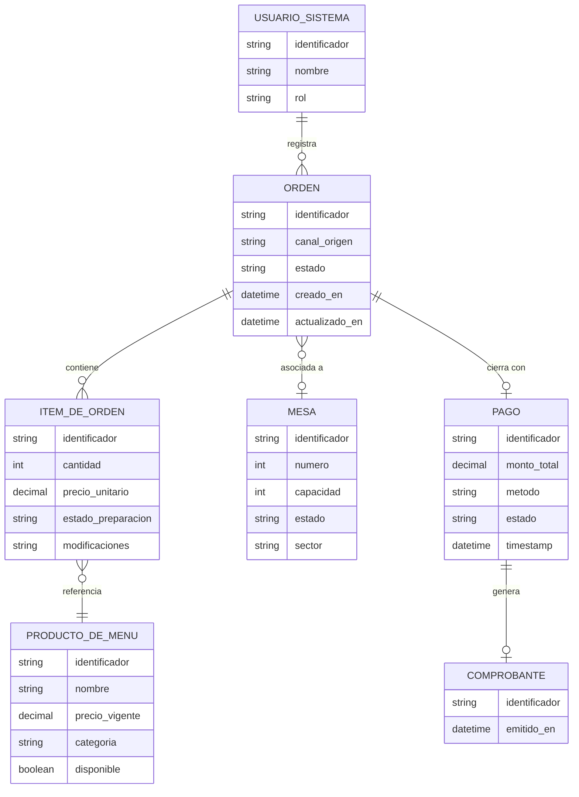

# Product Requirements Document (PRD)
## Sistema de Gestión de Órdenes de Restaurante (SGOR)
### Versión: 1.0 | Fecha: 2026-04-02

---

## 1. Visión General del Proyecto

### 1.1 Resumen Ejecutivo

**Problema identificado**

Una cadena de restaurantes en crecimiento opera actualmente con procesos manuales y fragmentados para la gestión de órdenes. Los síntomas críticos son: duplicación de información por parte del personal, retrasos en la comunicación hacia cocina, errores en la entrega de pedidos, y ausencia de trazabilidad sobre el estado de las órdenes. Estos problemas se agravan en horarios de alta demanda (hora punta), donde la falta de un sistema centralizado genera pérdida de ingresos y deterioro de la experiencia del cliente.

**Solución propuesta**

El Sistema de Gestión de Órdenes de Restaurante (SGOR) es una plataforma digital centralizada que unifica la recepción de pedidos de múltiples canales (mesas físicas y canales digitales), comunica en tiempo real las comandas a cocina con organización por prioridad, provee trazabilidad completa del ciclo de vida de cada orden, y cierra el flujo con integración de pagos y facturación vinculada.

**Valor de negocio**

- Eliminación de la duplicación de trabajo del personal de sala
- Reducción de errores en entrega por centralización del registro de órdenes
- Reducción de tiempos muertos en cocina mediante comunicación instantánea y organizada
- Visibilidad gerencial en tiempo real sobre el estado operacional del restaurante
- Base de datos estructurada para futuras iniciativas de análisis de inventario y optimización de tiempos de servicio

### 1.2 Criterios de Éxito Medibles

| ID | Criterio | Indicador | Meta v1 |
|----|---------|-----------|---------|
| CS-01 | Reducción de errores en pedidos | % de órdenes con correcciones post-registro | Reducción del 80% respecto a línea base manual |
| CS-02 | Velocidad de comunicación a cocina | Tiempo entre registro de orden y recepción en cocina | Menos de 5 segundos |
| CS-03 | Trazabilidad completa | % de órdenes con historial de estados completo | 100% de las órdenes registradas |
| CS-04 | Disponibilidad del sistema | Uptime en horario operacional | 99.5% mensual |
| CS-05 | Cobertura de canales | Canales de pedido integrados | Mesa física + canal digital (app/web) |
| CS-06 | Cierre de ciclo de pago | % de cuentas cerradas vinculadas a su orden | 100% |

### 1.3 Alcance del Proyecto

**En alcance (v1)**
- Gestión del ciclo completo de la orden: registro, preparación, entrega, cierre
- Recepción de órdenes desde mesas físicas (operadas por meseros)
- Recepción de órdenes desde canal digital (operadas por el cliente directamente)
- Comunicación en tiempo real de comandas a la estación de cocina
- Panel de administración con visualización de estados de órdenes
- Módulo de cierre de cuenta y facturación vinculada a la orden
- Gestión del menú (catálogo de ítems disponibles)
- Gestión de mesas (identificación, estado de ocupación)

**Fuera de alcance (v1) — Won't Have**
- Módulo de inventario (previsto para v2)
- Análisis avanzado de datos y reportes de optimización (previsto para v2)
- Integración con plataformas de delivery externas (Rappi, UberEats, etc.)
- Módulo de reservas
- Programa de fidelización de clientes
- Gestión de recursos humanos (turnos, nómina)
- Módulo de proveedores y compras

---

## 2. Stakeholders y Actores

### 2.1 Interesados (Stakeholders)

| Rol | Interés principal | Nivel de influencia |
|-----|-----------------|---------------------|
| Dueño de la cadena | ROI, visibilidad operacional, escalabilidad | Alto |
| Gerente de restaurante | Eficiencia operacional, reportes en tiempo real | Alto |
| Jefe de cocina | Claridad y organización de comandas entrantes | Medio |
| Personal de sala (meseros) | Rapidez en registro, reducción de errores | Medio |
| Clientes del restaurante | Experiencia de pedido fluida, tiempo de espera predecible | Bajo (indirecto) |
| Equipo de desarrollo | Claridad de requisitos, arquitectura escalable | Alto |

### 2.2 Actores del Sistema

**Actores Primarios** (interactúan directamente con el sistema)

| Actor | Descripción | Canal de acceso |
|-------|------------|----------------|
| Mesero | Personal de sala que registra y gestiona órdenes de mesas físicas | Terminal/tablet en sala |
| Cliente Digital | Cliente que realiza su pedido a través del canal digital (app o web) sin intermediario humano | App móvil / navegador web |
| Cocinero / Estación de Cocina | Personal de cocina que recibe, confirma y actualiza el estado de las comandas | Pantalla KDS (Kitchen Display System) |
| Administrador | Gerente o dueño que supervisa el panel de control y gestiona configuración | Panel web de administración |
| Cajero | Personal encargado de gestionar el cierre de cuenta y emisión de comprobante | Terminal de caja |

**Actores Secundarios** (apoyan el funcionamiento del sistema)

| Actor | Descripción |
|-------|------------|
| Sistema de Pagos | Plataforma externa que procesa las transacciones de pago (tarjeta, efectivo registrado) |
| Sistema de Notificaciones | Servicio que propaga actualizaciones de estado en tiempo real a los actores relevantes |

### 2.3 Preferencias Tecnológicas Registradas del Interesado

Las siguientes preferencias tecnológicas fueron expresadas por el cliente y se registran aquí como input para el Agente de Diseño. NO condicionan el análisis lógico de este documento:

- Backend: Spring Boot con WebFlux (reactivo), Arquitectura Hexagonal (Ports & Adapters)
- Base de datos: MongoDB Atlas
- Infraestructura: Supabase (funciones edge, autenticación)
- Comunicación en tiempo real: WebSockets / Server-Sent Events con Project Reactor

---

## 3. Glosario de Dominio (Lenguaje Ubicuo)

| Término | Definición | Sinónimos aceptados | Ejemplo |
|---------|-----------|---------------------|---------|
| Orden | Agrupación de ítems solicitados por un cliente en una sesión de consumo, asociada a una mesa o canal digital. Tiene un ciclo de vida completo desde su creación hasta el cierre del pago. | Pedido, Comanda (solo en contexto de cocina) | "La Orden #142 tiene 3 ítems en preparación" |
| Ítem de Orden | Unidad individual dentro de una Orden que representa la solicitud de un Producto del Menú en una cantidad determinada, con posibles modificaciones. | Línea de pedido, Detalle de orden | "1x Milanesa con papas fritas sin sal" |
| Producto de Menú | Artículo disponible para ser ordenado, con nombre, descripción, precio y categoría. Representa la oferta gastronómica del restaurante. | Plato, Ítem de menú | "Milanesa napolitana - $1.500" |
| Mesa | Unidad física de atención dentro del local. Tiene un identificador, capacidad y estado de ocupación. | Table | "Mesa 7 - Ocupada - 4 personas" |
| Estado de Orden | Etapa actual en el ciclo de vida de una Orden. Valores definidos: PENDIENTE, EN_PREPARACION, LISTA, ENTREGADA, CERRADA, CANCELADA. | Estado del pedido | "La Orden #142 está EN_PREPARACION" |
| Comanda | Representación de la Orden tal como es recibida y visualizada en la estación de cocina. Contiene la información necesaria para la preparación. | Ticket de cocina | "Comanda para Mesa 7: 2x Milanesa, 1x Ensalada" |
| Cierre de Cuenta | Proceso que ocurre al final de la sesión de consumo, donde se totaliza la Orden, se registra el método de pago y se emite el comprobante. | Factura, Cuenta | "El mesero solicita el cierre de cuenta para Mesa 7" |
| Pago | Registro de la transacción económica asociada al Cierre de Cuenta de una Orden. Incluye monto, método y estado de confirmación. | Cobro, Transacción | "Pago de $4.500 con tarjeta de crédito — Confirmado" |
| Comprobante | Documento o representación digital que certifica el Pago realizado. Vincula los ítems consumidos con el monto pagado. | Factura, Ticket, Recibo | "Comprobante #0042 emitido para Orden #142" |
| Canal de Pedido | Medio a través del cual se origina una Orden. Valores: MESA (operado por mesero) o DIGITAL (operado por el cliente). | Origen del pedido | "Orden originada en Canal DIGITAL" |
| Panel de Administración | Interfaz de visualización y control para el Administrador, que muestra el estado de todas las órdenes activas y métricas operacionales. | Dashboard, Panel de control | "El administrador visualiza 12 órdenes activas en el panel" |
| Prioridad de Comanda | Atributo que determina el orden de atención en la estación de cocina. Puede derivarse del tiempo de espera o de una asignación manual. | Urgencia | "La comanda de Mesa 3 tiene prioridad ALTA por tiempo de espera" |
| Modificación de Ítem | Instrucción especial asociada a un Ítem de Orden que altera su preparación estándar. | Nota especial, Personalización | "Sin cebolla", "Término bien cocido" |
| Sesión de Mesa | Período de tiempo durante el cual una Mesa está ocupada por un grupo de clientes, desde que se registra la primera Orden hasta el Cierre de Cuenta. | Turno de mesa | "La Sesión de Mesa 7 inició a las 20:15" |
| KDS | Kitchen Display System — pantalla instalada en la cocina que muestra las Comandas en tiempo real, reemplazando el ticket físico impreso. | Pantalla de cocina | "El KDS muestra 5 comandas pendientes ordenadas por prioridad" |

---

## 4. Modelo de Dominio Conceptual

### 4.1 Entidades y Value Objects

**Entidades** (tienen identidad propia que persiste en el tiempo)

| Entidad | Atributos lógicos principales | Descripción |
|---------|------------------------------|-------------|
| Orden | identificador, canal de origen, estado, timestamp de creación, timestamp de última actualización | Raíz del agregado principal. Agrupa ítems y tiene un ciclo de vida completo. |
| Ítem de Orden | identificador, referencia al Producto de Menú, cantidad, modificaciones, estado individual, precio al momento del pedido | Parte constitutiva de la Orden. Puede tener su propio estado de preparación. |
| Producto de Menú | identificador, nombre, descripción, precio vigente, categoría, disponibilidad | Oferta gastronómica. Su precio se congela en el Ítem al momento del pedido. |
| Mesa | identificador, número visible, capacidad, estado (LIBRE / OCUPADA / RESERVADA), sector | Unidad física de atención. |
| Pago | identificador, monto total, método de pago, estado (PENDIENTE / CONFIRMADO / RECHAZADO / REEMBOLSADO), timestamp | Registro de la transacción de cierre. |
| Comprobante | identificador, referencia al Pago, detalle de ítems consumidos, timestamp de emisión | Documento de cierre con validez para el cliente. |
| Usuario del Sistema | identificador, nombre, rol (MESERO / COCINERO / ADMINISTRADOR / CAJERO), estado activo | Actor humano con acceso al sistema. |

**Value Objects** (sin identidad propia; su igualdad se determina por sus valores)

| Value Object | Atributos | Descripción |
|-------------|-----------|-------------|
| Estado de Orden | valor enumerado: PENDIENTE, EN_PREPARACION, LISTA, ENTREGADA, CERRADA, CANCELADA | Representa la etapa actual del ciclo de vida de la Orden. |
| Canal de Pedido | valor enumerado: MESA, DIGITAL | Origen de la Orden. |
| Método de Pago | valor enumerado: EFECTIVO, TARJETA_CREDITO, TARJETA_DEBITO, TRANSFERENCIA | Medio utilizado para el Pago. |
| Modificación de Ítem | texto libre con instrucción de preparación | Personalización de un Ítem. |
| Precio Unitario | monto numérico + moneda | Precio congelado del Producto al momento del pedido. |
| Prioridad de Comanda | valor calculado o asignado: NORMAL, ALTA, URGENTE | Atributo de ordenamiento en el KDS. |

### 4.2 Aggregates (Fronteras de Consistencia)

| Aggregate Root | Entidades incluidas | Invariante de negocio |
|---------------|--------------------|-----------------------|
| Orden | Orden + Ítems de Orden | La Orden solo puede avanzar a través de estados permitidos. Los Ítems solo existen dentro de una Orden. |
| Producto de Menú | Producto de Menú | El precio de un Producto puede cambiar sin afectar Órdenes ya registradas (precio congelado en el Ítem). |
| Mesa | Mesa | Una Mesa solo puede estar asociada a una Sesión activa a la vez. |
| Pago | Pago + Comprobante | Un Comprobante solo se emite si el Pago tiene estado CONFIRMADO. |

### 4.3 Relaciones Lógicas entre Entidades



### 4.4 Ciclo de Vida de la Orden

```
PENDIENTE --> EN_PREPARACION --> LISTA --> ENTREGADA --> CERRADA
     |                                                      ^
     |                                                      |
     +--------------------> CANCELADA (desde cualquier estado previo a ENTREGADA)
```

Transiciones permitidas:
- PENDIENTE -> EN_PREPARACION: cuando la cocina acepta/inicia la comanda
- EN_PREPARACION -> LISTA: cuando la cocina marca el plato como listo
- LISTA -> ENTREGADA: cuando el mesero confirma la entrega en mesa
- ENTREGADA -> CERRADA: cuando el Pago es confirmado
- PENDIENTE | EN_PREPARACION -> CANCELADA: por solicitud del cliente o administrador

---

## 5. Requisitos Funcionales

### 5.1 Módulo de Gestión de Órdenes

#### CU-01: Registrar Nueva Orden desde Mesa Física

**Actor principal:** Mesero
**Precondición:** La Mesa existe en el sistema y tiene estado LIBRE o el mesero está agregando ítems a una Orden PENDIENTE existente de esa mesa.
**Postcondición:** La Orden queda registrada con estado PENDIENTE y la Comanda es enviada al KDS de cocina.

**Flujo principal:**
1. El mesero selecciona la mesa desde la interfaz de sala
2. El sistema muestra el menú disponible organizado por categorías
3. El mesero selecciona los productos y sus cantidades
4. El mesero puede agregar modificaciones a ítems individuales (texto libre)
5. El mesero confirma el pedido
6. El sistema registra la Orden con estado PENDIENTE, asocia la Mesa y registra el timestamp de creación
7. El sistema envía la Comanda al KDS de cocina con prioridad NORMAL
8. El sistema actualiza el estado de la Mesa a OCUPADA
9. El mesero recibe confirmación visual de que la orden fue registrada exitosamente

**Flujos alternativos:**
- FA-01: El mesero agrega ítems adicionales a una orden existente de esa mesa (la orden puede estar PENDIENTE o EN_PREPARACION). Los ítems nuevos se agregan como líneas separadas y se notifica a cocina.
- FA-02: Un producto seleccionado no está disponible — el sistema muestra un indicador de "no disponible" y no permite añadirlo.

**Flujos de excepción:**
- FE-01: Pérdida de conectividad durante el registro. El sistema debe indicar al mesero el fallo y preservar los datos ingresados para reintento.

---

#### CU-02: Registrar Nueva Orden desde Canal Digital

**Actor principal:** Cliente Digital
**Precondición:** El cliente accede al canal digital y el menú está disponible.
**Postcondición:** La Orden queda registrada con Canal de Pedido = DIGITAL y estado PENDIENTE.

**Flujo principal:**
1. El cliente accede al canal digital (escanea QR en mesa o accede por URL)
2. El sistema presenta el menú disponible organizado por categorías
3. El cliente selecciona productos, cantidades y modificaciones
4. El cliente revisa su resumen de orden
5. El cliente confirma el pedido
6. El sistema registra la Orden con canal DIGITAL y estado PENDIENTE
7. El sistema envía la Comanda al KDS de cocina
8. El cliente recibe confirmación con número de orden y puede seguir el estado

**Flujos alternativos:**
- FA-01: El cliente modifica su orden antes de confirmar (agrega o quita ítems del carrito)
- FA-02: El cliente abandona el flujo sin confirmar (la orden no se registra)

---

#### CU-03: Cancelar Orden

**Actor principal:** Mesero / Administrador
**Precondición:** La Orden tiene estado PENDIENTE o EN_PREPARACION.
**Postcondición:** La Orden queda en estado CANCELADA y se notifica a cocina si la preparación había iniciado.

**Flujo principal:**
1. El actor selecciona la orden a cancelar
2. El actor ingresa el motivo de cancelación (campo obligatorio)
3. El sistema valida que la Orden es cancelable (no ENTREGADA ni CERRADA)
4. El sistema actualiza el estado a CANCELADA y registra el motivo y el usuario que canceló
5. Si la Orden estaba EN_PREPARACION, el sistema notifica al KDS de cocina
6. Si existe un pago parcial registrado, se inicia flujo de reembolso

---

#### CU-04: Agregar Ítems a Orden Existente

**Actor principal:** Mesero
**Precondición:** Existe una Orden activa para la mesa (estado PENDIENTE o EN_PREPARACION).
**Postcondición:** Los nuevos ítems son añadidos a la Orden y notificados a cocina.

**Flujo principal:**
1. El mesero accede a la orden activa de la mesa
2. El mesero selecciona los productos adicionales con cantidades y modificaciones
3. El mesero confirma la adición
4. El sistema agrega los ítems a la Orden y envía una notificación de adición al KDS

---

### 5.2 Módulo de Cocina (KDS)

#### CU-05: Visualizar Comandas en Tiempo Real

**Actor principal:** Cocinero / Estación de Cocina
**Precondición:** El sistema tiene órdenes en estado PENDIENTE o EN_PREPARACION.
**Postcondición:** El cocinero puede ver todas las comandas activas ordenadas por prioridad.

**Flujo principal:**
1. La pantalla KDS muestra todas las Comandas activas en tiempo real
2. Las Comandas se presentan ordenadas por: Prioridad (descendente) y luego por timestamp de creación (ascendente — más antigua primero)
3. Cada Comanda muestra: número de orden, mesa o canal digital, ítems con sus modificaciones, tiempo de espera transcurrido
4. Cuando una nueva Orden es registrada, aparece automáticamente en el KDS sin recargar la página
5. El sistema actualiza automáticamente el tiempo de espera transcurrido de cada comanda visible

---

#### CU-06: Actualizar Estado de Preparación

**Actor principal:** Cocinero
**Precondición:** Existe una Comanda en estado PENDIENTE o EN_PREPARACION visible en el KDS.
**Postcondición:** El estado de la Orden es actualizado y el mesero y el administrador son notificados.

**Flujo principal:**
1. El cocinero selecciona una Comanda del KDS
2. El cocinero cambia el estado al siguiente: PENDIENTE -> EN_PREPARACION -> LISTA
3. El sistema actualiza el Estado de la Orden
4. El sistema notifica en tiempo real al mesero responsable y al panel de administración
5. Si el estado es LISTA, el mesero recibe una alerta para retirar el pedido

**Flujo alternativo:**
- FA-01: El cocinero puede marcar un ítem individual como listo (útil cuando platos de la misma orden se terminan en momentos distintos)

---

#### CU-07: Gestionar Prioridad de Comanda

**Actor principal:** Administrador / Cocinero
**Precondición:** Existen Comandas activas en el KDS.
**Postcondición:** La Comanda tiene su prioridad actualizada y el KDS reordena la vista.

**Flujo principal:**
1. El actor selecciona una Comanda
2. El actor cambia la prioridad (NORMAL / ALTA / URGENTE)
3. El sistema actualiza la prioridad y reordena el KDS inmediatamente
4. El cambio de prioridad queda registrado con el usuario que lo realizó

---

### 5.3 Módulo de Pagos y Facturación

#### CU-08: Solicitar Cierre de Cuenta

**Actor principal:** Mesero / Cliente Digital
**Precondición:** La Orden tiene estado ENTREGADA.
**Postcondición:** Se genera el resumen de cuenta listo para el pago.

**Flujo principal:**
1. El mesero (o cliente digital) solicita el cierre de cuenta para la Orden
2. El sistema presenta el resumen: listado de ítems consumidos, cantidades, precios unitarios y total
3. El actor confirma el resumen
4. El sistema genera un registro de Pago en estado PENDIENTE con el monto total calculado

---

#### CU-09: Registrar Pago

**Actor principal:** Cajero / Mesero
**Precondición:** Existe un Pago en estado PENDIENTE para la Orden.
**Postcondición:** El Pago queda en estado CONFIRMADO, se emite el Comprobante y la Orden pasa a estado CERRADA.

**Flujo principal:**
1. El cajero selecciona el método de pago (EFECTIVO, TARJETA_CREDITO, TARJETA_DEBITO, TRANSFERENCIA)
2. Si el pago es con tarjeta, el sistema se comunica con el Sistema de Pagos externo para procesar la transacción
3. El Sistema de Pagos confirma la transacción
4. El sistema actualiza el Pago a estado CONFIRMADO
5. El sistema emite el Comprobante vinculado al Pago y a los ítems de la Orden
6. El sistema actualiza el estado de la Orden a CERRADA
7. El sistema libera la Mesa (estado -> LIBRE)
8. El Comprobante es presentado al cliente (formato digital y/o impreso)

**Flujo alternativo:**
- FA-01: Pago dividido en múltiples métodos (p.ej. parte efectivo, parte tarjeta). El sistema debe permitir registrar montos parciales hasta completar el total.

**Flujo de excepción:**
- FE-01: El Sistema de Pagos rechaza la transacción. El sistema notifica al cajero con el motivo del rechazo y el Pago permanece PENDIENTE.

---

### 5.4 Módulo de Administración

#### CU-10: Visualizar Panel de Estado Operacional

**Actor principal:** Administrador
**Precondición:** El administrador tiene sesión activa.
**Postcondición:** El administrador visualiza el estado en tiempo real de todas las órdenes y mesas.

**Flujo principal:**
1. El administrador accede al panel de administración
2. El sistema presenta:
   - Vista general de mesas: estado (LIBRE / OCUPADA), número de orden activa, tiempo de sesión
   - Lista de órdenes activas ordenadas por estado y tiempo
   - Conteo de órdenes por estado
   - Alertas de órdenes con tiempo de espera excesivo (configurable)
3. La información se actualiza en tiempo real sin necesidad de recargar

---

#### CU-11: Gestionar Menú (Productos)

**Actor principal:** Administrador
**Precondición:** El administrador tiene sesión activa con permisos de gestión de menú.
**Postcondición:** Los cambios en el menú son visibles para el siguiente pedido.

**Flujo principal (agregar producto):**
1. El administrador accede a la sección de gestión de menú
2. El administrador crea un nuevo Producto de Menú con: nombre, descripción, precio, categoría
3. El sistema valida los datos y registra el producto como disponible

**Flujo alternativo — actualizar disponibilidad:**
- Un producto puede marcarse como NO disponible de forma inmediata, lo que lo oculta del menú visible para meseros y clientes digitales

**Flujo alternativo — actualizar precio:**
- El cambio de precio aplica únicamente a nuevas órdenes; los ítems ya registrados conservan el precio al momento del pedido

---

#### CU-12: Gestionar Mesas

**Actor principal:** Administrador
**Precondición:** El administrador tiene sesión activa.
**Postcondición:** La configuración de mesas refleja el estado real del local.

**Flujo principal:**
1. El administrador puede crear, editar o desactivar una Mesa
2. Atributos configurables: número de mesa, capacidad, sector
3. El sistema no permite desactivar una Mesa con una Sesión activa

---

#### CU-13: Consultar Historial de Órdenes

**Actor principal:** Administrador
**Precondición:** El administrador tiene sesión activa.
**Postcondición:** El administrador visualiza el historial filtrado.

**Flujo principal:**
1. El administrador aplica filtros: rango de fechas, estado, mesa, canal de pedido
2. El sistema retorna la lista de órdenes que coinciden con los filtros
3. El administrador puede ver el detalle completo de cualquier orden (ítems, estados, timestamps, pago)

---

### 5.5 User Stories por Actor

**Mesero:**

```
US-01
COMO mesero
QUIERO registrar una nueva orden para una mesa seleccionando productos del menú
PARA evitar la duplicación manual de información y reducir errores en el pedido

Criterios de Aceptación:
- DADO que una mesa está libre o tiene una orden activa,
  CUANDO el mesero selecciona productos y confirma,
  ENTONCES la orden queda registrada y la comanda aparece en el KDS en menos de 5 segundos.

- DADO que un producto no está disponible,
  CUANDO el mesero intenta añadirlo,
  ENTONCES el sistema impide la selección y muestra el motivo de no disponibilidad.
```

```
US-02
COMO mesero
QUIERO recibir una alerta cuando los platos de una mesa están listos
PARA retirarlos de cocina y entregarlos sin demora

Criterios de Aceptación:
- DADO que una comanda cambia a estado LISTA en el KDS,
  CUANDO el sistema procesa el cambio,
  ENTONCES el mesero responsable recibe una notificación en su terminal en menos de 3 segundos.

- DADO que el mesero confirma la entrega en mesa,
  CUANDO presiona "Marcar como Entregada",
  ENTONCES el estado de la orden cambia a ENTREGADA y el KDS la elimina de las vistas activas.
```

```
US-03
COMO mesero
QUIERO agregar ítems adicionales a una orden en curso
PARA atender solicitudes adicionales del cliente sin abrir un nuevo pedido

Criterios de Aceptación:
- DADO que existe una orden activa para una mesa,
  CUANDO el mesero agrega ítems adicionales,
  ENTONCES los nuevos ítems aparecen en el KDS como una adición diferenciada de la comanda original.
```

**Cocinero:**

```
US-04
COMO cocinero
QUIERO ver todas las comandas activas ordenadas por prioridad en la pantalla KDS
PARA preparar los pedidos en el orden correcto y sin necesidad de tickets físicos

Criterios de Aceptación:
- DADO que existen comandas en estados PENDIENTE o EN_PREPARACION,
  CUANDO el cocinero observa el KDS,
  ENTONCES las comandas se muestran ordenadas: primero por prioridad (URGENTE > ALTA > NORMAL) y luego por tiempo de espera (mayor primero).

- DADO que una nueva orden es registrada,
  CUANDO el sistema la procesa,
  ENTONCES la comanda aparece en el KDS en tiempo real sin necesidad de recargar la pantalla.
```

```
US-05
COMO cocinero
QUIERO marcar una comanda como "En Preparación" y luego como "Lista"
PARA comunicar el estado de los platos al personal de sala en tiempo real

Criterios de Aceptación:
- DADO que una comanda está en estado PENDIENTE,
  CUANDO el cocinero la marca como EN_PREPARACION,
  ENTONCES el estado se actualiza y el panel de administración refleja el cambio inmediatamente.

- DADO que una comanda está EN_PREPARACION,
  CUANDO el cocinero la marca como LISTA,
  ENTONCES el mesero responsable recibe una alerta y la comanda se destaca visualmente en el KDS.
```

**Cliente Digital:**

```
US-06
COMO cliente digital
QUIERO realizar mi pedido directamente desde mi dispositivo escaneando un código QR en la mesa
PARA no depender de la disponibilidad del mesero para registrar mi orden

Criterios de Aceptación:
- DADO que el cliente escanea el QR de su mesa,
  CUANDO accede al menú digital,
  ENTONCES visualiza el menú completo con solo los productos disponibles y puede completar su pedido.

- DADO que el cliente confirma su pedido,
  CUANDO el sistema lo procesa,
  ENTONCES el cliente recibe un número de orden y puede visualizar el estado de su pedido en tiempo real.
```

**Administrador:**

```
US-07
COMO administrador
QUIERO ver en un panel el estado de todas las órdenes y mesas en tiempo real
PARA tomar decisiones operacionales durante el servicio sin necesidad de desplazarme

Criterios de Aceptación:
- DADO que el administrador accede al panel,
  CUANDO hay órdenes activas,
  ENTONCES el panel muestra el estado de cada mesa y el resumen de órdenes por estado, actualizado en tiempo real.

- DADO que una orden supera el umbral de tiempo de espera configurado,
  CUANDO el sistema detecta la condición,
  ENTONCES el panel genera una alerta visual diferenciada para esa orden.
```

```
US-08
COMO administrador
QUIERO poder marcar un producto del menú como no disponible de forma inmediata
PARA evitar que los meseros o clientes puedan pedirlo cuando se ha agotado

Criterios de Aceptación:
- DADO que un producto existe en el menú,
  CUANDO el administrador cambia su estado a "no disponible",
  ENTONCES el producto deja de mostrarse en la interfaz de toma de pedidos de forma inmediata.
```

**Cajero:**

```
US-09
COMO cajero
QUIERO registrar el pago de una orden y emitir el comprobante vinculado
PARA cerrar el ciclo de la orden con exactitud y ofrecer un comprobante al cliente

Criterios de Aceptación:
- DADO que una orden está en estado ENTREGADA y se ha solicitado el cierre de cuenta,
  CUANDO el cajero registra el pago confirmado,
  ENTONCES el comprobante es generado con el detalle exacto de ítems consumidos y montos, y la mesa queda liberada.

- DADO que el sistema de pagos externo rechaza una transacción,
  CUANDO el cajero intenta confirmar el pago,
  ENTONCES el sistema muestra el motivo del rechazo y el pago permanece en estado PENDIENTE.
```

---

## 6. Requisitos No Funcionales

### 6.1 Disponibilidad

| ID | Requisito | Meta |
|----|----------|------|
| RNF-01 | Uptime del sistema en horario operacional (definido por el cliente) | 99.5% mensual |
| RNF-02 | El sistema debe recuperarse de un fallo transitorio sin pérdida de órdenes en curso | RTO < 2 minutos |
| RNF-03 | Los datos de órdenes en tránsito deben ser resilientes ante reinicios del servicio | Tolerancia a fallos con persistencia de estado |

### 6.2 Rendimiento

| ID | Requisito | Meta |
|----|----------|------|
| RNF-04 | Latencia máxima en propagación de evento (orden registrada -> aparece en KDS) | < 5 segundos en condiciones normales |
| RNF-05 | Latencia máxima en propagación de alertas (LISTA -> notificación a mesero) | < 3 segundos |
| RNF-06 | Tiempo de carga inicial de la interfaz de toma de pedidos | < 2 segundos en red local |
| RNF-07 | El sistema debe soportar al menos 50 órdenes concurrentes sin degradación perceptible | Carga base v1 |

### 6.3 Escalabilidad

| ID | Requisito | Meta |
|----|----------|------|
| RNF-08 | La arquitectura debe permitir escalar horizontalmente el servicio de procesamiento de órdenes | Sin rediseño estructural |
| RNF-09 | El sistema debe soportar la adición de nuevos locales (multi-tenant) sin cambios en el núcleo | Preparado para expansión de cadena |
| RNF-10 | El volumen de histórico de órdenes no debe degradar el rendimiento de las operaciones activas | Separación lógica de datos activos e históricos |

### 6.4 Seguridad

| ID | Requisito | Meta |
|----|----------|------|
| RNF-11 | Todos los usuarios del sistema deben autenticarse antes de acceder a cualquier función | Autenticación obligatoria |
| RNF-12 | El acceso a funciones debe estar restringido por rol (RBAC) | Mesero no puede acceder al panel admin; Cocinero no puede registrar pagos |
| RNF-13 | Las comunicaciones entre cliente y servidor deben estar cifradas | TLS en tránsito |
| RNF-14 | Los datos de pago no deben ser almacenados directamente por el sistema — se delega al procesador externo | PCI-DSS básico: no almacenamiento de datos de tarjeta |
| RNF-15 | Las acciones críticas (cancelación, cambio de precio, cierre de cuenta) deben quedar en un log de auditoría con usuario y timestamp | Trazabilidad de operaciones sensibles |

### 6.5 Usabilidad

| ID | Requisito | Meta |
|----|----------|------|
| RNF-16 | La interfaz del KDS debe ser operable con interacción táctil | Pantallas táctiles en cocina |
| RNF-17 | La interfaz de toma de pedidos del mesero debe ser utilizable sin capacitación extensa | Curva de aprendizaje < 30 minutos |
| RNF-18 | El canal digital para el cliente debe ser accesible sin instalación de app nativa (primera iteración) | Acceso vía navegador web |

### 6.6 Mantenibilidad

| ID | Requisito | Meta |
|----|----------|------|
| RNF-19 | La arquitectura debe permitir agregar nuevos canales de pedido sin modificar el núcleo de dominio | Extensibilidad por puertos |
| RNF-20 | Las integraciones con sistemas externos (pagos, notificaciones) deben ser reemplazables sin afectar la lógica de negocio | Inversión de dependencias |

---

## 7. Reglas de Negocio

| ID | Regla | Fuente | Tipo | Impacto | Prioridad |
|----|-------|--------|------|---------|-----------|
| RN-01 | El precio de un Ítem de Orden se congela en el momento del registro de la Orden; cambios posteriores en el Producto de Menú no afectan órdenes ya creadas | Integridad financiera | Negocio | Alto — afecta facturación y disputas | Must |
| RN-02 | Una Mesa solo puede tener una Sesión activa a la vez | Integridad operacional | Negocio | Alto — evita mezcla de órdenes entre clientes | Must |
| RN-03 | El Comprobante solo puede emitirse si el Pago tiene estado CONFIRMADO | Integridad financiera | Negocio | Alto — evita comprobantes sin respaldo | Must |
| RN-04 | Una Orden solo puede cancelarse si su estado es PENDIENTE o EN_PREPARACION; una vez ENTREGADA no es cancelable | Integridad operacional | Negocio | Medio — gestión de devoluciones manual fuera de v1 | Must |
| RN-05 | Las transiciones de estado de la Orden solo pueden seguir la secuencia definida; no se permiten saltos ni regresiones | Integridad de ciclo de vida | Negocio | Alto — garantiza consistencia del dominio | Must |
| RN-06 | El sistema no debe almacenar datos de tarjetas de crédito/débito; el procesamiento se delega completamente al proveedor de pagos externo | Regulatorio / PCI-DSS | Legal/Regulatorio | Alto — cumplimiento normativo | Must |
| RN-07 | Las órdenes con tiempo de espera superior al umbral configurado por el administrador deben destacarse como alerta en el panel y en el KDS | Operacional | Negocio | Medio — mejora de tiempos de servicio | Should |
| RN-08 | Un producto marcado como "no disponible" debe dejar de mostrarse en todas las interfaces de toma de pedidos de forma inmediata | Coherencia del menú | Negocio | Alto — evita pedidos imposibles de cumplir | Must |
| RN-09 | El motivo de cancelación de una Orden es obligatorio y queda registrado con el usuario que ejecutó la acción | Trazabilidad | Negocio | Medio — auditoría interna | Should |
| RN-10 | La Prioridad de una Comanda puede ser modificada manualmente por el Administrador o el Cocinero, dejando registro de quién realizó el cambio | Operacional | Negocio | Bajo | Could |
| RN-11 | El menú visible para el cliente digital debe reflejar solo productos con disponibilidad activa al momento de la consulta | Coherencia del catálogo | Negocio | Alto | Must |
| RN-12 | El sistema debe soportar multi-local (múltiples restaurantes de la cadena) con aislamiento de datos por local | Expansión de cadena | Negocio estratégico | Alto (diseño) — no funcional en v1 para usuario final | Should (arquitectural) |

---

## 8. Restricciones

### 8.1 Restricciones Legales/Regulatorias
- **PCI-DSS (básico)**: El sistema no debe almacenar números de tarjeta, CVV ni datos de banda magnética. El procesamiento de pagos con tarjeta debe delegarse a un proveedor certificado.
- **Facturación electrónica**: Dependiendo de la jurisdicción del cliente, los comprobantes podrían requerir cumplimiento con regulaciones de facturación electrónica local. Este requisito debe ser clarificado con el cliente antes del diseño del módulo de comprobantes. Registrado como **riesgo abierto** (ver Sección 10).

### 8.2 Restricciones de Negocio
- El sistema v1 debe estar operativo para el horario de producción del restaurante; las caídas en hora punta son inaceptables (visión del cliente: "mi restaurante no puede permitirse caídas del sistema en hora punta").
- El sistema debe funcionar en la infraestructura de red interna del restaurante, con tolerancia a interrupciones breves de internet (operación parcial offline a evaluar en diseño).

### 8.3 Preferencias Tecnológicas del Interesado (Registradas — No Vinculantes para este Análisis)

| Preferencia | Detalle |
|------------|---------|
| Backend | Spring Boot con WebFlux (reactivo), Arquitectura Hexagonal (Ports & Adapters) |
| Base de datos | MongoDB Atlas |
| Infraestructura | Supabase (funciones edge, autenticación) |
| Comunicación en tiempo real | WebSockets / Server-Sent Events con Project Reactor |
| Paradigma | Reactivo / no bloqueante |

Estas preferencias serán evaluadas y adoptadas (o justificadamente ajustadas) por el Agente de Diseño en la fase de arquitectura técnica.

---

## 9. Matriz de Priorización MoSCoW

### Must Have (Crítico para v1)

| ID | Requisito | Justificación |
|----|----------|---------------|
| R-01 | Registro de orden desde mesa física por mesero | Core del negocio — sin esto el sistema no tiene valor |
| R-02 | Registro de orden desde canal digital por cliente | Centralización de pedidos digitales — objetivo explícito del cliente |
| R-03 | Envío de comanda al KDS en tiempo real | Comunicación instantánea a cocina — objetivo explícito del cliente |
| R-04 | Actualización de estado de orden por el cocinero (PENDIENTE -> EN_PREPARACION -> LISTA) | Trazabilidad de ciclo de vida — objetivo explícito del cliente |
| R-05 | Notificación al mesero cuando la comanda está LISTA | Elimina esperas y mejora tiempos de entrega |
| R-06 | Confirmación de entrega por el mesero (ENTREGADA) | Completa la trazabilidad antes del cierre |
| R-07 | Panel de administración con estado en tiempo real de órdenes y mesas | Visibilidad gerencial — objetivo explícito del cliente |
| R-08 | Solicitud de cierre de cuenta por mesero | Inicio del flujo de pago |
| R-09 | Registro de pago y emisión de comprobante | Cierre del ciclo de negocio — objetivo explícito del cliente |
| R-10 | Gestión básica de menú (crear, editar, disponibilidad) | Sin menú no hay base para tomar pedidos |
| R-11 | Gestión de mesas (crear, estado) | Necesario para asociar órdenes a mesas físicas |
| R-12 | Autenticación de usuarios por rol | Seguridad mínima indispensable |
| R-13 | Control de acceso por rol (RBAC básico) | Integridad operacional y de datos |
| R-14 | Cancelación de orden con motivo | Gestión de excepciones operacionales |

### Should Have (Importante para v1, no bloqueante)

| ID | Requisito | Justificación |
|----|----------|---------------|
| R-15 | Prioridad de comanda con reordenamiento en KDS | Mejora la organización de cocina bajo alta carga |
| R-16 | Alertas visuales por tiempo de espera excesivo | Permite gestión proactiva por el administrador |
| R-17 | Adición de ítems a orden existente | Flujo operacional común en restaurantes |
| R-18 | Historial de órdenes con filtros básicos | Necesario para auditoría y control post-turno |
| R-19 | Pago dividido en múltiples métodos | Necesidad operacional frecuente |
| R-20 | Soporte multi-local a nivel arquitectural (aislamiento de datos por local) | Cadena en crecimiento — debe estar en el diseño base |

### Could Have (Deseable si el tiempo lo permite)

| ID | Requisito | Justificación |
|----|----------|---------------|
| R-21 | Seguimiento de estado de orden para el cliente digital en tiempo real | Mejora experiencia del cliente pero no es crítico para v1 |
| R-22 | Modificación de prioridad manual con registro de auditoría | Mejora la gestión de cocina pero no es crítico |
| R-23 | Gestión de sectores de sala (zonificación de mesas) | Útil para restaurantes grandes, no crítico para inicio |
| R-24 | Modo de operación offline parcial (degradado sin internet) | Alta complejidad técnica — evaluar en v2 |

### Won't Have (Fuera de alcance v1)

| ID | Requisito | Justificación |
|----|----------|---------------|
| R-25 | Módulo de inventario y control de stock | Previsto explícitamente para v2 por el cliente |
| R-26 | Análisis de datos y reportes de optimización | Previsto para v2 — requiere datos históricos acumulados |
| R-27 | Integración con plataformas de delivery (Rappi, UberEats) | Fuera del alcance declarado por el cliente |
| R-28 | Módulo de reservas | No mencionado en la solicitud inicial |
| R-29 | Programa de fidelización de clientes | No mencionado en la solicitud inicial |
| R-30 | Gestión de recursos humanos (turnos, nómina) | Fuera del dominio del sistema |
| R-31 | Gestión de proveedores y compras | Fuera del dominio del sistema — vinculado a inventario v2 |
| R-32 | Facturación electrónica con validación fiscal | Requiere clarificación regulatoria antes de diseñar |

---

## 10. Riesgos Identificados

| ID | Riesgo | Probabilidad | Impacto | Estrategia de Mitigación |
|----|--------|-------------|---------|--------------------------|
| RG-01 | Interrupción de red local en el restaurante durante hora punta | Media | Crítico | Diseño con capacidad de operación degradada offline para funciones core (registro de órdenes); sincronización al recuperar conectividad. Definir alcance exacto en fase de diseño. |
| RG-02 | Rechazo del sistema de pagos externo en momento de cierre de cuenta | Media | Alto | Flujo de reintento explícito; soporte para registrar pagos en efectivo como alternativa inmediata. |
| RG-03 | Resistencia del personal (meseros, cocineros) al cambio de proceso | Alta | Medio | Plan de capacitación incluido en la entrega; diseño de interfaz con curva de aprendizaje mínima (RNF-17). |
| RG-04 | Ambigüedad sobre requisitos de facturación electrónica según jurisdicción | Alta | Alto | Clarificar con el cliente la jurisdicción operativa antes del diseño del módulo de Comprobante. Incluir como condición previa para el sprint de pagos. |
| RG-05 | Carga de tráfico superior a la estimada (50 órdenes concurrentes) en restaurantes de mayor volumen | Baja | Medio | Diseño escalable horizontalmente (RNF-08) desde v1; definir plan de pruebas de carga antes del go-live. |
| RG-06 | El cliente añade requerimientos durante el desarrollo sin ajuste de alcance | Alta | Medio | Gestión formal de cambios de alcance; PRD versionado con aprobación del cliente. |
| RG-07 | Inconsistencia de datos entre el panel de administración y el KDS en caso de fallo temporal | Baja | Alto | Diseño con modelo de consistencia eventual documentado; reconciliación automática al restablecer conectividad. |

---

## 11. Criterios de Aceptación del Proyecto (Nivel de Análisis)

El presente análisis de requerimientos se considera completo cuando:

- [ ] Todos los actores identificados tienen al menos un caso de uso asociado
- [ ] Cada requisito Must Have tiene al menos dos criterios de aceptación en formato DADO/CUANDO/ENTONCES
- [ ] El Glosario de Dominio cubre todos los términos utilizados en los casos de uso y reglas de negocio
- [ ] La Matriz MoSCoW cubre el 100% de los requerimientos identificados
- [ ] Los riesgos regulatorios (facturación electrónica) están documentados y asignados para resolución
- [ ] Las preferencias tecnológicas del cliente están registradas y separadas del análisis lógico
- [ ] El documento es suficiente para que el Agente de Diseño elabore: diagramas C4, esquema de datos, y contratos de API

---

## 12. Próximos Pasos — Handoff al Agente de Diseño

### Lo que el Agente de Diseño recibirá de este documento

1. **Modelo de dominio conceptual completo**: Entidades, Value Objects, Aggregates y relaciones lógicas (Sección 4)
2. **Ciclo de vida de la Orden**: Máquina de estados con transiciones válidas definidas (Sección 4.4)
3. **Casos de uso detallados**: Flujos principales, alternativos y de excepción para cada función (Sección 5)
4. **Reglas de negocio**: 12 reglas con clasificación, impacto y prioridad (Sección 7)
5. **Requisitos no funcionales**: Metas medibles de disponibilidad, rendimiento, escalabilidad y seguridad (Sección 6)
6. **Preferencias tecnológicas del cliente**: Spring Boot WebFlux, MongoDB Atlas, Supabase, WebSockets/SSE (Sección 8.3)

### Áreas que requieren decisiones técnicas del Agente de Diseño

| Área | Decisión pendiente |
|------|-------------------|
| Comunicación en tiempo real | Elegir entre WebSockets persistentes vs SSE según el comportamiento cliente-servidor de cada flujo |
| Modelo de consistencia | Definir consistencia eventual vs fuerte para cada aggregate según el contexto reactivo |
| Estrategia offline | Diseñar el mecanismo de operación degradada y sincronización (RG-01) |
| Multi-tenancy | Diseñar el modelo de aislamiento por local (esquema, colección, o servicio) |
| Integración de pagos | Seleccionar y definir el contrato con el proveedor de pagos externo |
| Autenticación | Evaluar Supabase Auth vs solución propia para los flujos de autenticación por rol |
| Schema de datos | Modelar las colecciones MongoDB para cada Aggregate con su estrategia de indexación |

### Entregables esperados del Agente de Diseño

1. Diagramas C4 (Contexto, Contenedores, Componentes) — usar skill `springboot-hexagonal-builder:c4-architecture`
2. Schema de colecciones MongoDB — usar skill `springboot-hexagonal-builder:nosql-schema-builder`
3. Contratos de API (OpenAPI 3.x) — usar skill `springboot-hexagonal-builder:openapi-doc-builder`
4. Scaffold del microservicio con Arquitectura Hexagonal — usar skill `springboot-hexagonal-builder:hexagonal-architecture-builder`

---

*Documento generado por Axiom — Agente de Análisis de Requerimientos*
*Versión: 1.0 | Fecha: 2026-04-02*
*Este documento es el input formal para la fase de Diseño Técnico.*
