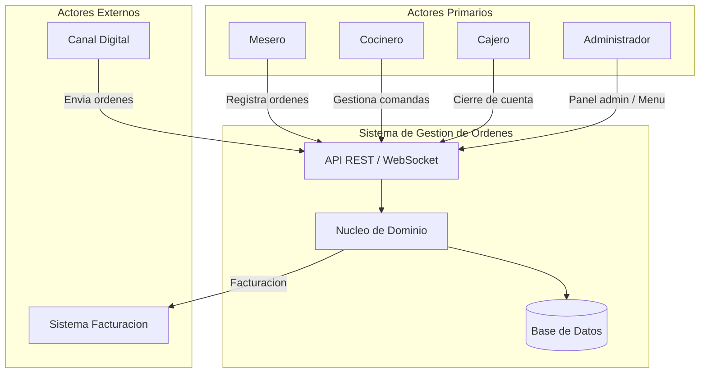
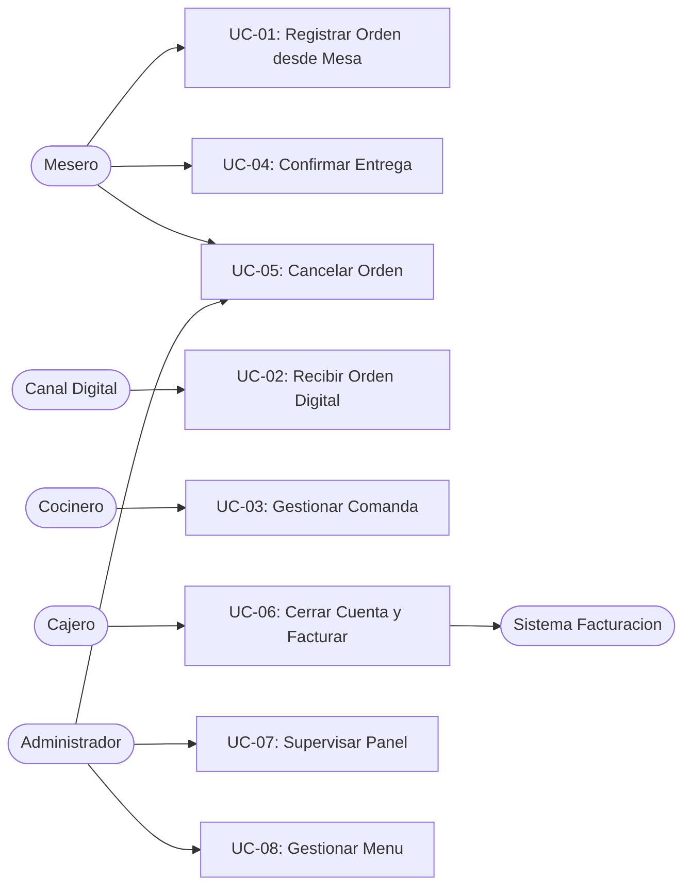
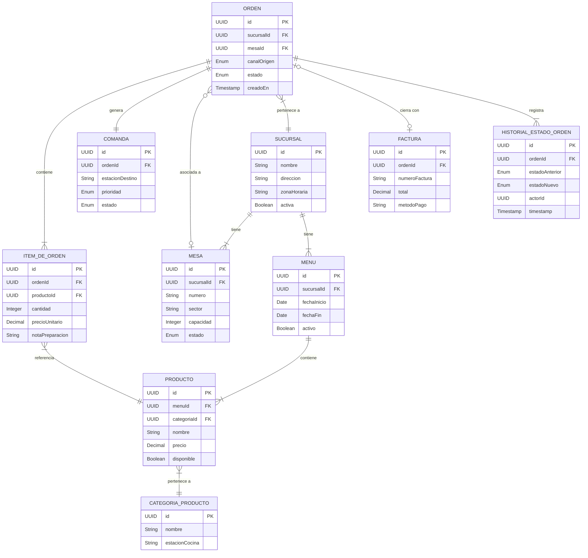

# Especificacion de Requisitos de Software (SRS)
## Sistema de Gestion de Ordenes — Cadena de Restaurantes

| Campo | Valor |
|-------|-------|
| Version | 1.0 |
| Fecha | 2026-04-02 |
| Autor | Equipo de Desarrollo |
| Estado | Borrador |
| Basado en | PRD v1.0 — Sistema de Gestion de Ordenes |

---

## Historial de Cambios

| Version | Fecha | Autor | Descripcion |
|---------|-------|-------|-------------|
| 1.0 | 2026-04-02 | Equipo de Desarrollo | Version inicial |

---

## Tabla de Contenidos

1. [Introduccion](#1-introduccion)
2. [Descripcion General](#2-descripcion-general)
3. [Requisitos Especificos](#3-requisitos-especificos)
4. [Casos de Uso](#4-casos-de-uso)
5. [Modelo de Datos](#5-modelo-de-datos)
6. [Matriz de Trazabilidad de Requisitos](#6-matriz-de-trazabilidad-de-requisitos)

---

## 1. Introduccion

### 1.1 Proposito

Este documento especifica los requisitos de software del **Sistema de Gestion de Ordenes** para una cadena de restaurantes en crecimiento. Establece los requisitos funcionales y no funcionales que el sistema debe cumplir, sirviendo como contrato tecnico entre el equipo de desarrollo y los interesados del proyecto.

**Audiencia**: Equipo de desarrollo, arquitectos de software, equipo de QA, gerentes de proyecto y stakeholders del negocio.

### 1.2 Alcance

**Nombre del sistema**: Sistema de Gestion de Ordenes (SGO)

**Que hace el sistema**:
- Centraliza la recepcion de ordenes desde mesas fisicas y canales digitales externos
- Transmite comandas a cocina en tiempo real con priorizacion
- Gestiona el ciclo de vida completo de una orden (PENDIENTE -> EN_PREPARACION -> LISTA -> ENTREGADA -> CERRADA)
- Proporciona un panel administrativo con visibilidad en tiempo real del estado de todas las ordenes
- Integra el cierre de cuenta con la generacion de facturas
- Gestiona el catalogo de productos (menu) por sucursal
- Soporta operacion multi-sucursal desde la primera version

**Que NO hace el sistema (v1.0)**:
- Analisis avanzado de datos ni inteligencia de inventario
- Optimizacion de tiempos de servicio con machine learning
- Gestion de reservas ni de mesas (mas alla del estado libre/ocupada)
- Gestion de proveedores o inventario de insumos
- Aplicacion movil para clientes finales
- Programa de fidelizacion o puntos

**Beneficios esperados**:
- Reduccion >= 80% de errores en entregas
- Transmision de comanda a cocina en < 5 segundos
- Disponibilidad del sistema >= 99.9%
- Reduccion >= 50% en tiempo de cierre de cuenta

### 1.3 Definiciones, Acronimos y Abreviaturas

| Termino | Definicion |
|---------|-----------|
| **Orden** | Solicitud formal de productos realizada por un cliente, asociada a una mesa o canal digital, con ciclo de vida completo hasta su entrega y cobro |
| **Item de Orden** | Unidad individual dentro de una orden: producto del menu con cantidad, precio y notas especiales opcionales |
| **Comanda** | Representacion de los items de una orden enviada a la estacion de cocina para su preparacion |
| **Mesa** | Espacio fisico identificado dentro de una sucursal donde se atiende a clientes |
| **Sucursal** | Local fisico perteneciente a la cadena donde opera el sistema |
| **Menu** | Catalogo de productos ofrecidos en una sucursal con precios y disponibilidad |
| **Producto** | Elemento del menu que puede ser ordenado |
| **Categoria de Producto** | Agrupacion logica de productos que permite organizar el menu y filtrar comandas por estacion de cocina |
| **Estado de Orden** | Etapa en el ciclo de vida: PENDIENTE, EN_PREPARACION, LISTA, ENTREGADA, CANCELADA, CERRADA |
| **Canal de Origen** | Medio de registro de la orden: MESA (mesero) o DIGITAL (plataforma externa) |
| **Cierre de Cuenta** | Accion de finalizar una orden para proceder a su cobro |
| **Factura** | Documento de cierre con productos consumidos, precios, impuestos y total |
| **Nota de Preparacion** | Instruccion especial asociada a un item para cocina |
| **Estacion de Cocina** | Division funcional dentro de cocina (ej: Cocina Caliente, Cocina Fria, Barra) |
| **SGO** | Sistema de Gestion de Ordenes |
| **RBAC** | Role-Based Access Control (Control de Acceso Basado en Roles) |
| **SSE** | Server-Sent Events |
| **WebFlux** | Framework reactivo de Spring para aplicaciones no bloqueantes |

### 1.4 Referencias

| Documento | Descripcion |
|-----------|-------------|
| PRD v1.0 | Product Requirements Document — Sistema de Gestion de Ordenes (2026-04-02) |
| IEEE 830-1998 | Estandar para especificaciones de requisitos de software |
| OWASP Top 10 | Riesgos de seguridad en aplicaciones web |

### 1.5 Vision General del Documento

- **Seccion 2** describe el contexto general del producto, sus usuarios, entorno operativo y restricciones.
- **Seccion 3** detalla los requisitos funcionales y no funcionales con criterios de aceptacion medibles.
- **Seccion 4** especifica los casos de uso con flujos principales, alternativos y de excepcion.
- **Seccion 5** presenta el modelo de datos con entidades, atributos y relaciones.
- **Seccion 6** contiene la matriz de trazabilidad que vincula requisitos, casos de uso y criterios de aceptacion.

---

## 2. Descripcion General

### 2.1 Perspectiva del Producto

El SGO es un **microservicio** que actua como nucleo operativo de la cadena de restaurantes, reemplazando los procesos manuales y fragmentados actuales. Se integra con:

- **Canales digitales externos** (plataformas de delivery) como fuente de ordenes entrantes
- **Sistema de facturacion / pasarela de pagos** externo para la emision de documentos fiscales
- **Interfaces de usuario** para meseros, cocineros, cajeros y administradores

### 2.2 Resumen de Funcionalidades

| # | Funcionalidad | Descripcion |
|---|--------------|-------------|
| F1 | Registro de ordenes | Recepcion desde mesa fisica y canales digitales |
| F2 | Gestion de comandas | Envio en tiempo real a cocina con priorizacion |
| F3 | Ciclo de vida de ordenes | Transiciones de estado con trazabilidad completa |
| F4 | Notificaciones en tiempo real | Alertas instantaneas entre cocina y sala |
| F5 | Panel administrativo | Supervision en tiempo real de todas las ordenes activas |
| F6 | Cierre de cuenta y facturacion | Consolidacion de consumos y emision de factura |
| F7 | Gestion del menu | CRUD de productos con disponibilidad y precios por sucursal |
| F8 | Cancelacion de ordenes | Con validacion de estado y notificacion a cocina |
| F9 | Soporte multi-sucursal | Aislamiento de datos y configuracion por local |
| F10 | Control de acceso (RBAC) | Permisos por rol: mesero, cocinero, cajero, administrador |

### 2.3 Clases de Usuarios y Caracteristicas

| Usuario | Nivel Tecnico | Frecuencia de Uso | Caracteristicas Clave |
|---------|--------------|-------------------|----------------------|
| **Mesero** | Basico | Continuo durante turno | Opera bajo presion; necesita interfaz rapida y simple; puede usar dispositivo movil o tablet |
| **Cocinero** | Basico | Continuo durante turno | Trabaja en entorno de cocina (calor, humedad); necesita pantalla legible a distancia; posible uso con guantes |
| **Cajero** | Medio | Intermitente | Opera al cierre de cada cuenta; necesita precision en montos y metodos de pago |
| **Administrador de Sucursal** | Medio-Alto | Intermitente | Necesita vision global de operaciones; acceso a configuracion de menu y reportes |
| **Canal Digital** | N/A (sistema) | Automatizado | Requiere API estable, bien documentada, con respuestas claras de error |

### 2.4 Entorno Operativo

| Aspecto | Especificacion |
|---------|---------------|
| **Arquitectura** | Microservicio con arquitectura hexagonal (Ports & Adapters) |
| **Stack tecnologico** | Java + Spring Boot WebFlux (reactivo, no bloqueante) |
| **Base de datos** | A definir por el equipo de arquitectura (compatible con operaciones reactivas) |
| **Protocolo de comunicacion** | HTTP/REST para API principal; WebSocket/SSE para comunicacion en tiempo real |
| **Despliegue** | Nube (contenedores Docker) |
| **Dispositivos cliente** | Tablets y dispositivos moviles (meseros), pantallas tactiles (cocina), terminales POS (cajeros), navegador web (administradores) |

### 2.5 Restricciones de Diseno e Implementacion

| ID | Restriccion | Tipo |
|----|------------|------|
| RD-01 | La arquitectura debe seguir el patron hexagonal (Ports & Adapters) | Arquitectura |
| RD-02 | El stack debe ser reactivo de extremo a extremo (Spring WebFlux + Project Reactor) | Tecnologia |
| RD-03 | Las facturas deben cumplir con la regulacion fiscal del pais de operacion | Legal |
| RD-04 | Los registros de ordenes y facturas cerradas deben ser inmutables | Integridad |
| RD-05 | El sistema debe operar multiples sucursales sin ventanas de mantenimiento en horas de servicio | Operacion |
| RD-06 | La arquitectura debe permitir incorporar modulos de analitica e inventario en fases futuras sin rediseno fundamental | Extensibilidad |

### 2.6 Suposiciones y Dependencias

**Suposiciones**:
- Cada sucursal cuenta con conectividad de red estable (WiFi o cableada)
- El personal recibira capacitacion basica antes del lanzamiento
- Existe un sistema de facturacion externo con API disponible para integracion
- Los canales digitales externos exponen un formato de datos estandarizable

**Dependencias**:
- Disponibilidad de la API del sistema de facturacion externo
- Definicion del contrato con canales digitales antes de la fase de desarrollo
- Provision de infraestructura de nube para despliegue

---

## 3. Requisitos Especificos

### 3.1 Requisitos Funcionales

#### 3.1.1 Modulo de Ordenes

| ID | Nombre | Descripcion | Prioridad | Criterios de Aceptacion |
|----|--------|-------------|-----------|------------------------|
| RF-ORD-001 | Registrar orden desde mesa | El sistema debe permitir al mesero registrar una nueva orden seleccionando una mesa activa, agregando items del menu vigente con cantidades y notas de preparacion opcionales. Al confirmar, el sistema debe asignar estado PENDIENTE y canal MESA. | Must | 1. La orden se registra con al menos 1 item y estado PENDIENTE. 2. El menu mostrado corresponde al menu activo de la sucursal. 3. Productos no disponibles no pueden ser agregados. 4. La orden se persiste y queda visible en el panel administrativo. |
| RF-ORD-002 | Recibir orden desde canal digital | El sistema debe exponer un endpoint que permita a canales digitales externos enviar ordenes. El sistema debe validar la estructura y disponibilidad de productos, registrar la orden con estado PENDIENTE y canal DIGITAL, y confirmar la recepcion al canal externo. | Must | 1. Orden con estructura valida y productos disponibles se registra correctamente. 2. Orden con producto no disponible es rechazada con codigo de error y motivo. 3. El canal recibe confirmacion o rechazo en la respuesta HTTP. |
| RF-ORD-003 | Gestionar ciclo de vida de orden | El sistema debe manejar las transiciones de estado validas de una orden: PENDIENTE -> EN_PREPARACION -> LISTA -> ENTREGADA -> CERRADA, y PENDIENTE/EN_PREPARACION -> CANCELADA. Toda transicion debe registrar timestamp y actor responsable. | Must | 1. Solo se permiten transiciones validas segun el diagrama de estados. 2. Cada transicion registra timestamp UTC y usuario que la ejecuto. 3. Transiciones invalidas son rechazadas con mensaje descriptivo. |
| RF-ORD-004 | Cancelar orden | El sistema debe permitir al mesero o administrador cancelar una orden en estado PENDIENTE o EN_PREPARACION, registrando el motivo y actor. Si la comanda ya fue enviada, debe notificar a cocina. | Must | 1. Ordenes en PENDIENTE o EN_PREPARACION se cancelan correctamente. 2. Ordenes en LISTA o ENTREGADA rechazan la cancelacion. 3. El motivo y actor quedan registrados. 4. Cocina recibe notificacion de cancelacion si la comanda fue enviada. |
| RF-ORD-005 | Consultar orden por identificador | El sistema debe permitir consultar el detalle completo de una orden incluyendo items, estado, timestamps de transiciones, mesa asociada y canal de origen. | Must | 1. Se retorna toda la informacion de la orden con sus items. 2. Incluye el historial de transiciones de estado. |
| RF-ORD-006 | Listar ordenes activas por sucursal | El sistema debe permitir listar todas las ordenes activas de una sucursal, con filtros opcionales por estado, canal de origen y mesa. | Must | 1. Se retornan solo las ordenes de la sucursal solicitada. 2. Los filtros se aplican correctamente. 3. Las ordenes cerradas y canceladas no aparecen como activas. |

#### 3.1.2 Modulo de Comandas y Cocina

| ID | Nombre | Descripcion | Prioridad | Criterios de Aceptacion |
|----|--------|-------------|-----------|------------------------|
| RF-CMD-001 | Generar y enviar comanda a cocina | El sistema debe generar automaticamente una comanda al confirmar una orden y enviarla en tiempo real a la estacion de cocina correspondiente. La transmision debe completarse en menos de 5 segundos desde la confirmacion. | Must | 1. La comanda se genera al confirmar la orden. 2. Aparece en la pantalla de cocina en < 5 segundos. 3. Incluye todos los items con cantidades y notas de preparacion. |
| RF-CMD-002 | Visualizar comandas en pantalla de cocina | El sistema debe mostrar las comandas pendientes ordenadas por prioridad (URGENTE primero, luego por antiguedad) en la pantalla de cocina, con detalle de items y notas de preparacion. | Must | 1. Las comandas se muestran ordenadas por prioridad y luego por fecha de creacion. 2. Los items y notas de preparacion son visibles. 3. La pantalla se actualiza en tiempo real. |
| RF-CMD-003 | Aceptar comanda (iniciar preparacion) | El sistema debe permitir al cocinero aceptar una comanda, actualizando el estado de la orden a EN_PREPARACION. | Must | 1. Al aceptar, la orden cambia a EN_PREPARACION. 2. El timestamp de inicio de preparacion queda registrado. |
| RF-CMD-004 | Completar comanda (marcar como lista) | El sistema debe permitir al cocinero marcar una comanda como completada, actualizando la orden a LISTA y notificando al mesero responsable en menos de 3 segundos. | Must | 1. La orden cambia a LISTA. 2. El mesero recibe notificacion en < 3 segundos. 3. La comanda desaparece de la lista de pendientes en cocina. |
| RF-CMD-005 | Rechazar item por falta de ingrediente | El sistema debe permitir al cocinero rechazar un item especifico de una comanda cuando un ingrediente se agota, notificando al mesero para que informe al cliente. | Should | 1. El item rechazado se marca en la orden. 2. El mesero recibe notificacion con el item rechazado. 3. El mesero puede actualizar la orden (reemplazar o remover item). |
| RF-CMD-006 | Enrutar comanda por estacion de cocina | El sistema debe enrutar automaticamente los items de una comanda a la estacion de cocina correspondiente segun la categoria del producto. | Should | 1. Items de parrilla van a Cocina Caliente. 2. Bebidas van a Barra. 3. Cada estacion solo ve sus items asignados. |
| RF-CMD-007 | Modificar prioridad de comanda | El sistema debe permitir al cocinero elevar la prioridad de una comanda a URGENTE. | Should | 1. La comanda reordenada aparece en la parte superior de la lista. 2. El cambio de prioridad queda registrado con timestamp. |

#### 3.1.3 Modulo de Notificaciones en Tiempo Real

| ID | Nombre | Descripcion | Prioridad | Criterios de Aceptacion |
|----|--------|-------------|-----------|------------------------|
| RF-NOT-001 | Notificar orden lista al mesero | El sistema debe enviar una notificacion en tiempo real al mesero responsable cuando una orden cambia a estado LISTA. | Must | 1. La notificacion llega en < 3 segundos. 2. Incluye el identificador de la orden y la mesa. |
| RF-NOT-002 | Notificar cancelacion a cocina | El sistema debe notificar a cocina en tiempo real cuando una orden en preparacion es cancelada. | Must | 1. La notificacion llega en < 3 segundos. 2. La comanda se marca como cancelada en pantalla de cocina. |
| RF-NOT-003 | Actualizar panel administrativo en tiempo real | El sistema debe emitir eventos de cambio de estado para que el panel administrativo se actualice sin recarga manual. | Must | 1. Los cambios de estado se reflejan en < 3 segundos. 2. No requiere accion del usuario para ver las actualizaciones. |

#### 3.1.4 Modulo de Cierre de Cuenta y Facturacion

| ID | Nombre | Descripcion | Prioridad | Criterios de Aceptacion |
|----|--------|-------------|-----------|------------------------|
| RF-FAC-001 | Cerrar cuenta | El sistema debe permitir al cajero solicitar el cierre de cuenta de una orden en estado ENTREGADA, consolidando todos los items con sus precios, calculando subtotal, impuestos y total. | Must | 1. Solo ordenes en estado ENTREGADA pueden cerrarse. 2. Los precios corresponden a los vigentes al momento de creacion de la orden. 3. El calculo de subtotal, impuestos y total es correcto. |
| RF-FAC-002 | Registrar metodo de pago | El sistema debe permitir al cajero registrar el metodo de pago utilizado (efectivo, tarjeta, etc.). | Must | 1. Se persiste el metodo de pago asociado a la factura. |
| RF-FAC-003 | Generar factura via sistema externo | El sistema debe integrarse con el sistema de facturacion externo para emitir la factura, enviando los datos de consumo y recibiendo el numero de factura generado. | Must | 1. Los datos enviados coinciden con el consumo real. 2. El numero de factura se asocia a la orden. 3. La orden cambia a estado CERRADA. 4. La mesa queda libre. |
| RF-FAC-004 | Reintentar facturacion fallida | Ante fallo del sistema de facturacion externo, el sistema debe persistir el intento de cierre y reintentar automaticamente. | Must | 1. El cierre pendiente no se pierde si falla el sistema externo. 2. El reintento es automatico. 3. El cajero puede ver el estado del cierre pendiente. |
| RF-FAC-005 | Dividir cuenta | El sistema debe permitir al cajero dividir la cuenta entre multiples metodos de pago. | Should | 1. Se pueden registrar N metodos de pago con montos parciales. 2. La suma de los parciales debe igualar el total. |
| RF-FAC-006 | Aplicar descuento | El sistema debe permitir al administrador aplicar un descuento antes del cierre de cuenta. | Could | 1. Solo el administrador puede autorizar descuentos. 2. El descuento queda registrado con motivo y actor. |

#### 3.1.5 Modulo de Menu

| ID | Nombre | Descripcion | Prioridad | Criterios de Aceptacion |
|----|--------|-------------|-----------|------------------------|
| RF-MEN-001 | Gestionar productos del menu | El sistema debe permitir al administrador agregar, modificar y desactivar productos del menu de su sucursal, incluyendo nombre, descripcion, precio, categoria y disponibilidad. | Must | 1. Los cambios se aplican inmediatamente a nuevas ordenes. 2. Los cambios de precio no afectan ordenes ya registradas. |
| RF-MEN-002 | Consultar menu activo | El sistema debe permitir consultar el menu activo de una sucursal con los productos disponibles, precios y categorias. | Must | 1. Solo retorna productos activos y disponibles. 2. Precios y categorias son correctos. |
| RF-MEN-003 | Gestionar categorias de productos | El sistema debe permitir al administrador crear y modificar categorias de productos, incluyendo la estacion de cocina de destino. | Must | 1. Las categorias pueden crearse y editarse. 2. La estacion de cocina asociada se usa para el enrutamiento de comandas. |

#### 3.1.6 Modulo de Sucursales y Mesas

| ID | Nombre | Descripcion | Prioridad | Criterios de Aceptacion |
|----|--------|-------------|-----------|------------------------|
| RF-SUC-001 | Gestionar sucursales | El sistema debe soportar el registro y configuracion de multiples sucursales con nombre, direccion y zona horaria. | Must | 1. Cada sucursal tiene configuracion independiente. 2. Los datos se persisten correctamente. |
| RF-SUC-002 | Gestionar mesas por sucursal | El sistema debe permitir al administrador gestionar las mesas de su sucursal (numero, sector, capacidad). | Must | 1. Las mesas son unicas dentro de una sucursal. 2. Una mesa con orden activa no puede asignarse a otra orden. |
| RF-SUC-003 | Liberar mesa automaticamente | El sistema debe liberar la mesa automaticamente cuando se cierra la cuenta de la orden asociada. | Must | 1. Al cerrar la cuenta, la mesa pasa a estado libre. 2. Queda disponible para nuevas ordenes. |

#### 3.1.7 Modulo de Seguridad y Acceso

| ID | Nombre | Descripcion | Prioridad | Criterios de Aceptacion |
|----|--------|-------------|-----------|------------------------|
| RF-SEC-001 | Autenticacion de usuarios | El sistema debe requerir autenticacion para todos los usuarios operativos del sistema. | Must | 1. No se permite acceso sin credenciales validas. 2. Las sesiones expiran por inactividad. |
| RF-SEC-002 | Control de acceso basado en roles | El sistema debe implementar RBAC con los roles: Mesero, Cocinero, Cajero, Administrador de Sucursal. Cada rol accede solo a las funciones de su competencia. | Must | 1. Mesero: registrar ordenes, confirmar entregas. 2. Cocinero: gestionar comandas. 3. Cajero: cierre de cuenta. 4. Admin: panel, menu, configuracion. |
| RF-SEC-003 | Autenticacion de canales digitales | El sistema debe autenticar a los canales digitales externos mediante mecanismo de API key o equivalente. | Must | 1. Canales no autenticados son rechazados con HTTP 401. 2. Cada canal tiene credenciales unicas. |

---

### 3.2 Requisitos No Funcionales

#### 3.2.1 Rendimiento

| ID | Requisito | Metrica Medible |
|----|-----------|----------------|
| RNF-PERF-001 | El sistema debe registrar una orden y enviar la comanda a cocina en menos de 5 segundos desde la confirmacion del usuario. | Latencia p95 < 5 segundos |
| RNF-PERF-002 | Las notificaciones de cambio de estado (orden lista, cancelacion) deben llegar al destinatario en menos de 3 segundos. | Latencia p95 < 3 segundos |
| RNF-PERF-003 | El panel administrativo debe reflejar cambios de estado en tiempo real con un retraso maximo de 3 segundos. | Latencia de actualizacion < 3 segundos |
| RNF-PERF-004 | Las consultas de listado de ordenes activas por sucursal deben responder en menos de 500ms. | Latencia p95 < 500ms |

#### 3.2.2 Seguridad

| ID | Requisito | Metrica Medible |
|----|-----------|----------------|
| RNF-SEC-001 | Todas las comunicaciones entre componentes y con sistemas externos deben estar cifradas en transito (TLS 1.2+). | 100% del trafico cifrado |
| RNF-SEC-002 | Las contrasenas deben almacenarse con hashing seguro (bcrypt o equivalente). | Verificable en auditoria de codigo |
| RNF-SEC-003 | El sistema debe implementar proteccion contra los 10 riesgos OWASP principales. | Auditoria de seguridad aprobada |
| RNF-SEC-004 | Los tokens de sesion deben tener expiracion configurable y ser revocables. | Verificable en pruebas |

#### 3.2.3 Disponibilidad y Confiabilidad

| ID | Requisito | Metrica Medible |
|----|-----------|----------------|
| RNF-AVAIL-001 | El sistema debe mantener un uptime >= 99.9% (maximo 8.7 horas de caida al anio). | Monitorizacion continua de uptime |
| RNF-AVAIL-002 | Ante fallo del sistema de facturacion externo, el sistema debe seguir operando y persistir los cierres pendientes con reintento automatico. | Prueba de fallo de integracion |
| RNF-AVAIL-003 | El sistema no debe tener ventanas de mantenimiento planificadas durante horas de servicio de los restaurantes. | Plan de mantenimiento documentado |
| RNF-AVAIL-004 | Ante perdida temporal de conectividad, el sistema debe mostrar alertas claras y conservar datos en estado borrador hasta restaurar la conexion. | Prueba de corte de red |

#### 3.2.4 Escalabilidad

| ID | Requisito | Metrica Medible |
|----|-----------|----------------|
| RNF-SCAL-001 | El sistema debe soportar la operacion concurrente de multiples sucursales sin degradacion de rendimiento. | Pruebas de carga con N sucursales simultaneas |
| RNF-SCAL-002 | El sistema debe absorber picos de carga de hasta 3x el trafico promedio en horas punta sin perdida de ordenes ni retrasos perceptibles. | Pruebas de estres con 3x carga |
| RNF-SCAL-003 | La arquitectura debe permitir escalado horizontal. | Verificable en diseno de despliegue |

#### 3.2.5 Usabilidad

| ID | Requisito | Metrica Medible |
|----|-----------|----------------|
| RNF-USAB-001 | La interfaz de meseros y cocineros debe ser operable con un entrenamiento maximo de 2 horas. | Pruebas de usabilidad con personal real |
| RNF-USAB-002 | Las pantallas de cocina deben ser legibles a distancia (minimo 2 metros) y operables con pantalla tactil o guantes. | Prueba en entorno real de cocina |
| RNF-USAB-003 | Las acciones criticas (confirmar orden, cambiar estado) deben requerir maximo 3 toques/clics desde la pantalla principal. | Analisis de flujos de interaccion |

#### 3.2.6 Mantenibilidad

| ID | Requisito | Metrica Medible |
|----|-----------|----------------|
| RNF-MAINT-001 | El codigo debe seguir la arquitectura hexagonal con separacion clara de dominio, aplicacion e infraestructura. | Revision de arquitectura |
| RNF-MAINT-002 | Toda la API publica debe estar documentada con OpenAPI 3.x. | Especificacion OpenAPI publicada |
| RNF-MAINT-003 | El sistema debe generar logs estructurados que permitan diagnosticar errores sin acceso al codigo fuente. | Logs en formato JSON con correlacion de trazas |

#### 3.2.7 Trazabilidad y Auditoria

| ID | Requisito | Metrica Medible |
|----|-----------|----------------|
| RNF-TRACE-001 | Toda transicion de estado de una orden debe quedar registrada con actor responsable, timestamp UTC y estado anterior/nuevo. | Audit log inmutable por orden |
| RNF-TRACE-002 | Los timestamps deben almacenarse en UTC y visualizarse en la zona horaria de la sucursal. | Verificable en interfaz y base de datos |

---

### 3.3 Requisitos de Interfaces Externas

#### 3.3.1 Interfaces de Usuario

| Interfaz | Descripcion | Usuarios | Requisitos Clave |
|----------|-------------|----------|-----------------|
| Pantalla de mesero | Registro y gestion de ordenes | Mesero | Rapida, tactil, mobile-first, flujo en maximo 3 pasos |
| Pantalla de cocina | Visualizacion y gestion de comandas | Cocinero | Legible a distancia, tactil, resistente a entorno de cocina |
| Terminal de caja | Cierre de cuenta y facturacion | Cajero | Precision numerica, integracion con impresora de tickets |
| Panel administrativo | Supervision y configuracion | Admin / Duenio | Dashboard en tiempo real, filtros, gestion de menu |

#### 3.3.2 Interfaces de Software

| Sistema Externo | Protocolo | Direccion | Descripcion |
|----------------|-----------|-----------|-------------|
| Canal Digital (Delivery) | REST API (HTTPS) | Entrada | Recibe ordenes de plataformas externas. El canal envia ordenes al SGO. |
| Sistema de Facturacion | REST API (HTTPS) | Salida | Envia datos de cierre de cuenta para emision de factura. |
| Sistema de Notificaciones | WebSocket / SSE | Bidireccional | Canal de comunicacion en tiempo real entre el servidor y los clientes (mesero, cocina, panel). |

#### 3.3.3 Interfaces de Comunicacion

| Protocolo | Uso | Formato |
|-----------|-----|---------|
| HTTPS (REST) | API principal del sistema y comunicacion con sistemas externos | JSON |
| WebSocket / SSE | Notificaciones en tiempo real y actualizaciones del panel | JSON |
| TLS 1.2+ | Cifrado de todas las comunicaciones | N/A |

---

## 4. Casos de Uso

### 4.1 Diagrama de Casos de Uso

### 4.2 Especificaciones de Casos de Uso

---

### UC-01: Registrar Orden desde Mesa

- **Actor**: Mesero
- **Precondiciones**: El mesero esta autenticado. La mesa esta activa y sin orden pendiente.
- **Postcondiciones**: La orden queda registrada en estado PENDIENTE. La comanda fue enviada a cocina.
- **Flujo Principal**:
  1. El mesero selecciona una mesa disponible en su sucursal.
  2. El sistema muestra el menu activo de la sucursal con productos disponibles.
  3. El mesero agrega items al pedido (producto, cantidad, notas de preparacion opcionales).
  4. El mesero confirma la orden.
  5. El sistema valida que todos los productos esten disponibles y que haya al menos un item.
  6. El sistema registra la orden con estado PENDIENTE, canal MESA, y timestamps.
  7. El sistema genera la comanda y la envia a la estacion de cocina correspondiente (< 5 seg).
  8. El sistema confirma visualmente al mesero que la orden fue registrada.
- **Flujos Alternativos**:
  - **4a**: Un producto no esta disponible — el sistema alerta al mesero y propone remover el item antes de confirmar.
  - **3a**: El mesero modifica la cantidad de un item antes de confirmar.
  - **3b**: El mesero agrega notas de preparacion a un item.
- **Flujos de Excepcion**:
  - **E1**: Perdida de conectividad — el sistema muestra alerta y conserva el pedido en estado borrador.

---

### UC-02: Recibir Orden desde Canal Digital

- **Actor**: Canal Digital Externo (sistema)
- **Precondiciones**: El canal esta integrado y autenticado via API key.
- **Postcondiciones**: La orden queda registrada en estado PENDIENTE, canal DIGITAL.
- **Flujo Principal**:
  1. El canal digital envia una solicitud HTTP con los datos de la orden (items, origen, sucursal destino).
  2. El sistema valida la autenticacion del canal.
  3. El sistema valida la estructura de la solicitud y la disponibilidad de cada producto.
  4. El sistema registra la orden con estado PENDIENTE y canal DIGITAL.
  5. El sistema genera la comanda y la envia a cocina.
  6. El sistema retorna HTTP 201 con el identificador de la orden al canal externo.
- **Flujos de Excepcion**:
  - **E1**: Canal no autenticado — HTTP 401 Unauthorized.
  - **E2**: Estructura invalida — HTTP 400 Bad Request con detalle del error.
  - **E3**: Producto no disponible — HTTP 422 Unprocessable Entity con lista de productos no disponibles.

---

### UC-03: Gestionar Comanda en Cocina

- **Actor**: Cocinero
- **Precondiciones**: Existen comandas pendientes asignadas a la estacion del cocinero.
- **Postcondiciones**: La comanda fue procesada y la orden cambio de estado.
- **Flujo Principal**:
  1. El sistema muestra las comandas pendientes ordenadas por prioridad (URGENTE primero).
  2. El cocinero visualiza los items con notas de preparacion.
  3. El cocinero acepta la comanda — el sistema actualiza la orden a EN_PREPARACION.
  4. El cocinero completa la preparacion y marca la comanda como completada.
  5. El sistema actualiza la orden a LISTA.
  6. El sistema notifica al mesero que la orden esta lista (< 3 seg).
- **Flujos Alternativos**:
  - **3a**: El cocinero marca items individuales como listos cuando tienen distinta complejidad.
  - **3b**: El cocinero eleva la prioridad de la comanda a URGENTE.
- **Flujos de Excepcion**:
  - **E1**: Ingrediente agotado — el cocinero rechaza un item y el sistema notifica al mesero.

---

### UC-04: Confirmar Entrega de Orden

- **Actor**: Mesero
- **Precondiciones**: La orden esta en estado LISTA.
- **Postcondiciones**: La orden esta en estado ENTREGADA.
- **Flujo Principal**:
  1. El mesero recibe notificacion de orden lista.
  2. El mesero retira los platos de cocina y los entrega en la mesa.
  3. El mesero confirma la entrega en el sistema.
  4. El sistema actualiza la orden a ENTREGADA.

---

### UC-05: Cancelar Orden

- **Actor**: Mesero o Administrador de Sucursal
- **Precondiciones**: La orden esta en estado PENDIENTE o EN_PREPARACION.
- **Postcondiciones**: La orden esta en estado CANCELADA con motivo registrado.
- **Flujo Principal**:
  1. El actor solicita la cancelacion indicando un motivo.
  2. El sistema valida que la orden sea cancelable (PENDIENTE o EN_PREPARACION).
  3. El sistema actualiza el estado a CANCELADA y registra motivo, actor y timestamp.
  4. Si la comanda fue enviada a cocina, el sistema notifica la cancelacion.
- **Flujos de Excepcion**:
  - **E1**: Orden en estado LISTA o ENTREGADA — el sistema rechaza la cancelacion con mensaje descriptivo.

---

### UC-06: Cerrar Cuenta y Generar Factura

- **Actor**: Cajero
- **Precondiciones**: La orden esta en estado ENTREGADA.
- **Postcondiciones**: La factura fue emitida, la orden esta CERRADA y la mesa esta libre.
- **Flujo Principal**:
  1. El cajero solicita el cierre de cuenta de una orden o mesa.
  2. El sistema consolida los items entregados con precios, calcula subtotal, impuestos y total.
  3. El cajero verifica el monto y registra el metodo de pago.
  4. El sistema envia los datos al sistema de facturacion externo.
  5. El sistema recibe el numero de factura generado.
  6. El sistema marca la orden como CERRADA y libera la mesa.
  7. El sistema presenta al cajero el numero de factura.
- **Flujos Alternativos**:
  - **3a**: El cajero divide la cuenta entre multiples metodos de pago.
  - **2a**: El administrador aplica un descuento antes del cierre.
- **Flujos de Excepcion**:
  - **E1**: Sistema de facturacion no responde — el sistema persiste el cierre pendiente y reintenta automaticamente.

---

### UC-07: Supervisar Panel Administrativo

- **Actor**: Administrador de Sucursal / Duenio
- **Precondiciones**: El actor tiene rol de administrador y esta autenticado.
- **Postcondiciones**: N/A (consulta).
- **Flujo Principal**:
  1. El administrador accede al panel de su sucursal.
  2. El sistema muestra todas las ordenes activas agrupadas por estado con tiempo transcurrido.
  3. El administrador puede filtrar por estado, canal de origen o mesa.
  4. El panel se actualiza en tiempo real sin recarga manual.

---

### UC-08: Gestionar Menu

- **Actor**: Administrador de Sucursal
- **Precondiciones**: El administrador tiene permisos sobre el menu de su sucursal.
- **Postcondiciones**: Los cambios en el menu aplican inmediatamente a nuevas ordenes.
- **Flujo Principal**:
  1. El administrador accede a la gestion de menu.
  2. El administrador agrega, modifica precios, activa o desactiva productos.
  3. El sistema aplica los cambios inmediatamente para nuevas ordenes.
  4. Las ordenes ya registradas conservan los precios originales.

---

## 5. Modelo de Datos

### 5.1 Descripcion de Entidades

#### Orden

| Atributo | Tipo | Obligatorio | Descripcion |
|----------|------|-------------|-------------|
| id | UUID | Si | Identificador unico de la orden |
| sucursalId | UUID | Si | Sucursal donde se origina la orden |
| mesaId | UUID | No | Mesa asociada (null para canal digital) |
| canalOrigen | Enum (MESA, DIGITAL) | Si | Canal por el que se registro la orden |
| estado | Enum | Si | Estado actual: PENDIENTE, EN_PREPARACION, LISTA, ENTREGADA, CANCELADA, CERRADA |
| motivoCancelacion | String | No | Motivo de cancelacion (si aplica) |
| creadoPor | UUID | Si | Usuario que registro la orden |
| creadoEn | Timestamp (UTC) | Si | Fecha y hora de creacion |
| actualizadoEn | Timestamp (UTC) | Si | Fecha y hora de ultima actualizacion |

#### ItemDeOrden

| Atributo | Tipo | Obligatorio | Descripcion |
|----------|------|-------------|-------------|
| id | UUID | Si | Identificador unico del item |
| ordenId | UUID | Si | Orden a la que pertenece |
| productoId | UUID | Si | Producto del menu referenciado |
| nombreProducto | String | Si | Nombre del producto al momento de la orden (snapshot) |
| cantidad | Integer | Si | Cantidad solicitada (>= 1) |
| precioUnitario | Decimal | Si | Precio al momento de la creacion de la orden |
| notaPreparacion | String | No | Instruccion especial para cocina |
| estadoPreparacion | Enum | Si | PENDIENTE, EN_PREPARACION, LISTO, RECHAZADO |

#### Comanda

| Atributo | Tipo | Obligatorio | Descripcion |
|----------|------|-------------|-------------|
| id | UUID | Si | Identificador unico de la comanda |
| ordenId | UUID | Si | Orden de la que se genera |
| estacionDestino | String | No | Estacion de cocina de destino |
| prioridad | Enum (NORMAL, URGENTE) | Si | Nivel de prioridad |
| estado | Enum | Si | PENDIENTE, EN_PREPARACION, COMPLETADA, CANCELADA |
| enviadaEn | Timestamp (UTC) | Si | Momento de envio a cocina |
| aceptadaEn | Timestamp (UTC) | No | Momento de aceptacion por cocinero |
| completadaEn | Timestamp (UTC) | No | Momento de finalizacion |

#### Producto

| Atributo | Tipo | Obligatorio | Descripcion |
|----------|------|-------------|-------------|
| id | UUID | Si | Identificador unico |
| menuId | UUID | Si | Menu al que pertenece |
| categoriaId | UUID | Si | Categoria del producto |
| nombre | String | Si | Nombre del producto |
| descripcion | String | No | Descripcion del producto |
| precio | Decimal | Si | Precio actual |
| disponible | Boolean | Si | Si esta disponible para ordenar |
| activo | Boolean | Si | Si esta activo en el menu |

#### CategoriaProducto

| Atributo | Tipo | Obligatorio | Descripcion |
|----------|------|-------------|-------------|
| id | UUID | Si | Identificador unico |
| nombre | String | Si | Nombre de la categoria |
| estacionCocina | String | No | Estacion de cocina de destino (ej: Cocina Caliente, Barra) |

#### Menu

| Atributo | Tipo | Obligatorio | Descripcion |
|----------|------|-------------|-------------|
| id | UUID | Si | Identificador unico |
| sucursalId | UUID | Si | Sucursal a la que pertenece |
| fechaInicio | Date | Si | Inicio de vigencia |
| fechaFin | Date | No | Fin de vigencia (null = indefinido) |
| activo | Boolean | Si | Si el menu esta activo |

#### Mesa

| Atributo | Tipo | Obligatorio | Descripcion |
|----------|------|-------------|-------------|
| id | UUID | Si | Identificador unico |
| sucursalId | UUID | Si | Sucursal a la que pertenece |
| numero | String | Si | Numero o codigo de la mesa |
| sector | String | No | Sector del restaurante |
| capacidad | Integer | No | Numero de comensales |
| estado | Enum (LIBRE, OCUPADA) | Si | Estado actual |

#### Sucursal

| Atributo | Tipo | Obligatorio | Descripcion |
|----------|------|-------------|-------------|
| id | UUID | Si | Identificador unico |
| nombre | String | Si | Nombre de la sucursal |
| direccion | String | Si | Direccion fisica |
| zonaHoraria | String | Si | Zona horaria (ej: America/Bogota) |
| activa | Boolean | Si | Si la sucursal esta operativa |

#### Factura

| Atributo | Tipo | Obligatorio | Descripcion |
|----------|------|-------------|-------------|
| id | UUID | Si | Identificador unico |
| ordenId | UUID | Si | Orden asociada |
| numeroFactura | String | Si | Numero fiscal de la factura (del sistema externo) |
| subtotal | Decimal | Si | Suma de items sin impuestos |
| impuestos | Decimal | Si | Total de impuestos |
| total | Decimal | Si | Monto total a cobrar |
| metodoPago | String | Si | Metodo de pago utilizado |
| emitidaEn | Timestamp (UTC) | Si | Fecha y hora de emision |
| estado | Enum (PENDIENTE, EMITIDA, FALLIDA) | Si | Estado de la factura |

#### HistorialEstadoOrden (Audit Log)

| Atributo | Tipo | Obligatorio | Descripcion |
|----------|------|-------------|-------------|
| id | UUID | Si | Identificador unico |
| ordenId | UUID | Si | Orden asociada |
| estadoAnterior | Enum | Si | Estado antes de la transicion |
| estadoNuevo | Enum | Si | Estado despues de la transicion |
| actorId | UUID | Si | Usuario que ejecuto la transicion |
| timestamp | Timestamp (UTC) | Si | Momento de la transicion |
| detalle | String | No | Informacion adicional (ej: motivo de cancelacion) |

### 5.2 Diagrama Entidad-Relacion

---

## 6. Matriz de Trazabilidad de Requisitos

| ID Requisito | Nombre | Caso de Uso | Criterios Aceptacion | Prioridad | Estado |
|-------------|--------|-------------|---------------------|-----------|--------|
| RF-ORD-001 | Registrar orden desde mesa | UC-01 | AC-ORD-001 a AC-ORD-004 | Must | Definido |
| RF-ORD-002 | Recibir orden desde canal digital | UC-02 | AC-ORD-005 a AC-ORD-007 | Must | Definido |
| RF-ORD-003 | Gestionar ciclo de vida de orden | UC-01, UC-03, UC-04, UC-05, UC-06 | AC-ORD-008 a AC-ORD-010 | Must | Definido |
| RF-ORD-004 | Cancelar orden | UC-05 | AC-ORD-011 a AC-ORD-014 | Must | Definido |
| RF-ORD-005 | Consultar orden por identificador | UC-07 | AC-ORD-015, AC-ORD-016 | Must | Definido |
| RF-ORD-006 | Listar ordenes activas por sucursal | UC-07 | AC-ORD-017 a AC-ORD-019 | Must | Definido |
| RF-CMD-001 | Generar y enviar comanda a cocina | UC-01, UC-02 | AC-CMD-001 a AC-CMD-003 | Must | Definido |
| RF-CMD-002 | Visualizar comandas en cocina | UC-03 | AC-CMD-004 a AC-CMD-006 | Must | Definido |
| RF-CMD-003 | Aceptar comanda | UC-03 | AC-CMD-007, AC-CMD-008 | Must | Definido |
| RF-CMD-004 | Completar comanda | UC-03 | AC-CMD-009 a AC-CMD-011 | Must | Definido |
| RF-CMD-005 | Rechazar item por falta de ingrediente | UC-03 | AC-CMD-012 a AC-CMD-014 | Should | Definido |
| RF-CMD-006 | Enrutar comanda por estacion | UC-03 | AC-CMD-015 a AC-CMD-017 | Should | Definido |
| RF-CMD-007 | Modificar prioridad de comanda | UC-03 | AC-CMD-018, AC-CMD-019 | Should | Definido |
| RF-NOT-001 | Notificar orden lista al mesero | UC-03, UC-04 | AC-NOT-001, AC-NOT-002 | Must | Definido |
| RF-NOT-002 | Notificar cancelacion a cocina | UC-05 | AC-NOT-003, AC-NOT-004 | Must | Definido |
| RF-NOT-003 | Actualizar panel en tiempo real | UC-07 | AC-NOT-005, AC-NOT-006 | Must | Definido |
| RF-FAC-001 | Cerrar cuenta | UC-06 | AC-FAC-001 a AC-FAC-003 | Must | Definido |
| RF-FAC-002 | Registrar metodo de pago | UC-06 | AC-FAC-004 | Must | Definido |
| RF-FAC-003 | Generar factura via sistema externo | UC-06 | AC-FAC-005 a AC-FAC-008 | Must | Definido |
| RF-FAC-004 | Reintentar facturacion fallida | UC-06 | AC-FAC-009 a AC-FAC-011 | Must | Definido |
| RF-FAC-005 | Dividir cuenta | UC-06 | AC-FAC-012, AC-FAC-013 | Should | Definido |
| RF-FAC-006 | Aplicar descuento | UC-06 | AC-FAC-014, AC-FAC-015 | Could | Definido |
| RF-MEN-001 | Gestionar productos del menu | UC-08 | AC-MEN-001, AC-MEN-002 | Must | Definido |
| RF-MEN-002 | Consultar menu activo | UC-01, UC-02 | AC-MEN-003, AC-MEN-004 | Must | Definido |
| RF-MEN-003 | Gestionar categorias | UC-08 | AC-MEN-005, AC-MEN-006 | Must | Definido |
| RF-SUC-001 | Gestionar sucursales | — | AC-SUC-001, AC-SUC-002 | Must | Definido |
| RF-SUC-002 | Gestionar mesas | — | AC-SUC-003, AC-SUC-004 | Must | Definido |
| RF-SUC-003 | Liberar mesa automaticamente | UC-06 | AC-SUC-005, AC-SUC-006 | Must | Definido |
| RF-SEC-001 | Autenticacion de usuarios | Todos | AC-SEC-001, AC-SEC-002 | Must | Definido |
| RF-SEC-002 | Control de acceso RBAC | Todos | AC-SEC-003 a AC-SEC-006 | Must | Definido |
| RF-SEC-003 | Autenticacion de canales digitales | UC-02 | AC-SEC-007, AC-SEC-008 | Must | Definido |
| RNF-PERF-001 | Latencia de registro de orden | UC-01, UC-02 | p95 < 5s | Must | Definido |
| RNF-PERF-002 | Latencia de notificaciones | UC-03, UC-05 | p95 < 3s | Must | Definido |
| RNF-AVAIL-001 | Disponibilidad 99.9% | Global | Uptime anual | Must | Definido |
| RNF-SCAL-001 | Operacion multi-sucursal concurrente | Global | Pruebas de carga | Must | Definido |
| RNF-SCAL-002 | Absorcion de picos 3x | Global | Pruebas de estres | Must | Definido |
| RNF-SEC-001 | Cifrado en transito | Global | TLS 1.2+ | Must | Definido |
| RNF-TRACE-001 | Audit log de transiciones | UC-01 a UC-06 | Log inmutable | Must | Definido |

---

## Reglas de Negocio Vinculadas

Las siguientes reglas de negocio (documentadas en detalle en el PRD) condicionan la implementacion de los requisitos funcionales:

| ID | Regla | Requisitos Impactados |
|----|-------|----------------------|
| RN-01 | No se aceptan ordenes con productos no disponibles | RF-ORD-001, RF-ORD-002 |
| RN-02 | Solo se cancela en PENDIENTE o EN_PREPARACION | RF-ORD-004 |
| RN-03 | Cierre de cuenta solo sobre ordenes ENTREGADA | RF-FAC-001 |
| RN-04 | Cambios de precio no afectan ordenes existentes | RF-MEN-001, RF-FAC-001 |
| RN-05 | Mesa con orden activa no admite nueva orden | RF-ORD-001, RF-SUC-002 |
| RN-06 | Toda cancelacion registra motivo y actor | RF-ORD-004 |
| RN-07 | Comandas se enrutan por categoria/estacion | RF-CMD-006 |
| RN-08 | Orden debe tener al menos un item | RF-ORD-001, RF-ORD-002 |
| RN-09 | Precios en factura = precios al crear la orden | RF-FAC-001, RF-FAC-003 |
| RN-10 | Panel admin restringido a roles Admin/Duenio | RF-SEC-002 |

---

*Documento generado conforme al estandar IEEE 830 adaptado a practicas modernas de desarrollo.*
*Version: 1.0 | Fecha: 2026-04-02*
*Basado en: PRD v1.0 — Sistema de Gestion de Ordenes*
