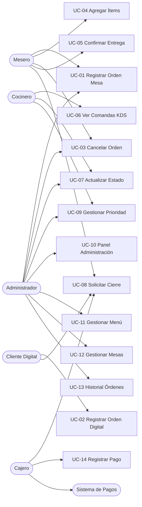
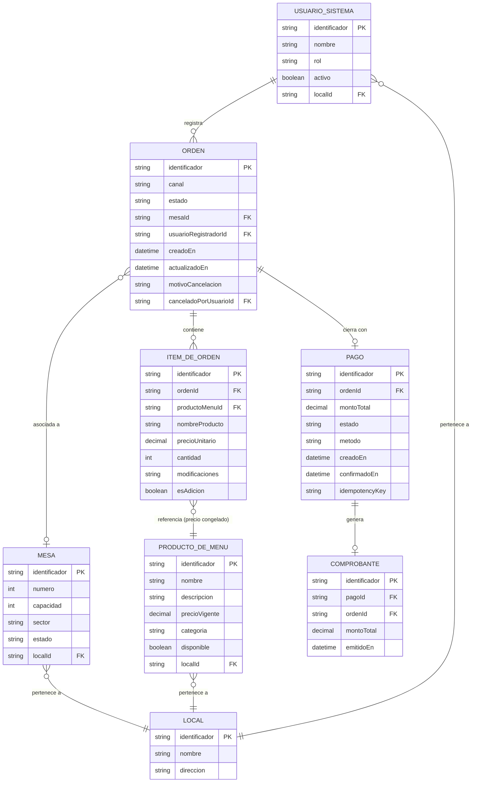

# Software Requirements Specification (SRS)
## Sistema de Gestión de Órdenes de Restaurante (SGOR)

| Field | Value |
|-------|-------|
| Version | 1.0 |
| Date | 2026-04-02 |
| Author | Axiom — Requirements Analysis Agent |
| Status | Draft |
| Profile | Standard (IEEE 830 adapted) |

---

## Change History

| Version | Date | Author | Description |
|---------|------|--------|-------------|
| 1.0 | 2026-04-02 | Axiom | Initial version — generated from PRD v1.0 |

---

## Table of Contents

1. [Introduction](#1-introduction)
2. [General Description](#2-general-description)
3. [Specific Requirements](#3-specific-requirements)
   - 3.1 Functional Requirements
   - 3.2 Non-Functional Requirements
   - 3.3 External Interface Requirements
4. [Use Cases](#4-use-cases)
5. [Data Model](#5-data-model)
6. [Requirements Traceability Matrix](#6-requirements-traceability-matrix)

---

## 1. Introduction

### 1.1 Purpose

This Software Requirements Specification (SRS) defines the functional and non-functional requirements for the **Sistema de Gestión de Órdenes de Restaurante (SGOR)**, version 1.0. It is written for the software development team, system architects, and quality assurance engineers who will design, build, and validate the system.

This document serves as the formal contract between the requirements analysis phase and the technical design phase. All design decisions, data schemas, and API contracts produced in subsequent phases shall trace back to requirements defined here.

### 1.2 Scope

**System name:** Sistema de Gestión de Órdenes de Restaurante (SGOR)

**What the system does:**
- Centralizes order reception from physical tables (operated by waitstaff) and digital channels (operated directly by customers)
- Communicates kitchen orders (comandas) in real time to the Kitchen Display System (KDS), organized by priority
- Provides full lifecycle traceability for every order, from creation through payment closure
- Enables administrative oversight through a real-time control panel
- Closes the business cycle with payment registration and receipt generation linked to the exact order

**What the system does NOT do (v1):**
- Inventory management and stock control
- Advanced analytics or optimization reporting
- Integration with external delivery platforms (Rappi, UberEats, etc.)
- Table reservations management
- Customer loyalty programs
- Human resources or payroll management
- Supplier and purchasing management
- Legally-compliant electronic invoicing (pending jurisdictional clarification — see risk RG-04)

**Business objectives:**
- Eliminate manual duplication of order information by waitstaff
- Reduce order errors through centralized digital registration
- Reduce kitchen idle time through instant, organized comanda communication
- Provide management with real-time operational visibility
- Establish a structured data foundation for future analytics initiatives (v2)

### 1.3 Definitions, Acronyms, and Abbreviations

| Term | Definition |
|------|-----------|
| **Orden** | Order — a grouping of requested items for a customer session, associated with a table or digital channel. Has a full lifecycle from creation to payment closure. |
| **Ítem de Orden** | Order Item — an individual unit within an Order representing a Menu Product request with a specific quantity and optional modifications. |
| **Producto de Menú** | Menu Product — an item available for ordering with name, description, price, and category. |
| **Mesa** | Table — a physical service unit within the restaurant with an identifier, capacity, and occupancy state. |
| **Estado de Orden** | Order Status — the current lifecycle stage: PENDIENTE, EN_PREPARACION, LISTA, ENTREGADA, CERRADA, CANCELADA. |
| **Comanda** | The kitchen-facing representation of an Order, displayed on the KDS with all preparation details. |
| **Cierre de Cuenta** | Account closure — the process of totaling the order, registering payment, and issuing a receipt. |
| **Pago** | Payment — the financial transaction record associated with account closure. |
| **Comprobante** | Receipt — the document certifying a confirmed payment, linking consumed items to the paid amount. |
| **Canal de Pedido** | Order Channel — the origin medium: MESA (table, operated by waiter) or DIGITAL (operated by the customer). |
| **KDS** | Kitchen Display System — the screen installed in the kitchen showing real-time comandas. |
| **Prioridad de Comanda** | Comanda Priority — ordering attribute for the KDS: NORMAL, ALTA, URGENTE. |
| **Sesión de Mesa** | Table Session — the period a table is occupied from first order to account closure. |
| **RBAC** | Role-Based Access Control — access model where permissions are granted by role. |
| **RTO** | Recovery Time Objective — maximum acceptable time to restore service after a failure. |
| **RPO** | Recovery Point Objective — maximum acceptable data loss window measured in time. |
| **TLS** | Transport Layer Security — cryptographic protocol for secure communications. |
| **PCI-DSS** | Payment Card Industry Data Security Standard — compliance framework for card payment handling. |
| **SGOR** | Sistema de Gestión de Órdenes de Restaurante — the system being specified in this document. |
| **PRD** | Product Requirements Document — the strategic planning document that precedes this SRS. |

### 1.4 References

| Reference | Description |
|-----------|-------------|
| PRD-sistema-gestion-ordenes-restaurante v1.0 | Product Requirements Document — strategic requirements source |
| IEEE Std 830-1998 | IEEE Recommended Practice for Software Requirements Specifications |
| PCI-DSS v4.0 | Payment Card Industry Data Security Standard |
| OWASP Top 10 (2021) | Web Application Security Risks reference |

### 1.5 Document Overview

- **Section 2** describes the product from a broad perspective: its context, user classes, operating environment, and assumptions.
- **Section 3** contains the detailed specific requirements: functional (organized by module), non-functional (organized by quality attribute), and external interfaces.
- **Section 4** specifies the use cases with actor, preconditions, postconditions, and step-by-step flows.
- **Section 5** defines the conceptual data model with entity descriptions and an entity-relationship diagram.
- **Section 6** provides the requirements traceability matrix linking every requirement to its use case and acceptance criteria.

---

## 2. General Description

### 2.1 Product Perspective

SGOR is a new standalone system that replaces entirely manual and fragmented paper-based order management processes at a growing restaurant chain. It does not integrate with or extend any existing internal software.

The system operates within the restaurant's local network for core operations (order registration, KDS communication) and connects to an external payment processor for card transaction handling.

At a chain level, SGOR shall be designed to support multiple restaurant locations (multi-tenant), with data isolation per location, without requiring a separate deployment per location.

```
+------------------+       +-------------------+       +--------------------+
|  Restaurant      |       |   SGOR Platform   |       | External Systems   |
|  Local Network   |       |                   |       |                    |
|                  |       |  +-------------+  |       | +----------------+ |
| [Waiter Tablet]  +------>+  | Order Mgmt  |  +------>+ | Payment Proc.  | |
| [Kitchen KDS]    +<------+  | Module      |  |       | +----------------+ |
| [Admin Panel]    +<------+  +-------------+  |       |                    |
| [Customer QR]    +------>+  | KDS Engine  |  |       | +----------------+ |
| [Cashier Term.]  +------>+  | (Real-time) |  |       | | Notif. Service | |
|                  |       |  +-------------+  +<------+ +----------------+ |
+------------------+       |  | Payment     |  |       +--------------------+
                            |  | Module      |  |
                            |  +-------------+  |
                            |  | Admin       |  |
                            |  | Module      |  |
                            +--+-------------+--+
```

### 2.2 Product Features Summary

- **Multi-channel order reception** — Physical table orders (via waiter) and digital orders (via customer QR/web)
- **Real-time KDS integration** — Instant comanda delivery to kitchen, ordered by priority and wait time
- **Order lifecycle management** — Full status tracking: PENDIENTE → EN_PREPARACION → LISTA → ENTREGADA → CERRADA
- **Real-time administrative panel** — Live overview of all tables and active orders with wait-time alerts
- **Payment and receipt module** — Account closure with multi-method payment support and itemized receipt generation
- **Menu management** — Create, edit, and control product availability with immediate effect across all interfaces
- **Table management** — Configure and monitor table states and occupancy
- **Role-based access control** — Separate permission scopes for Mesero, Cocinero, Administrador, and Cajero
- **Audit trail** — Immutable log of all critical operations

### 2.3 User Classes and Characteristics

| User Class | Technical Level | Frequency of Use | Key Needs |
|-----------|-----------------|-----------------|-----------|
| **Mesero** | Low — no technical background expected | High — every working shift, continuously | Fast order entry, minimum taps, clear status feedback |
| **Cocinero** | Low — no technical background expected | High — every working shift, continuously | Touch-friendly KDS, clear comanda display, simple state transitions |
| **Administrador** | Medium — comfortable with management software | Medium — daily, several times per shift | Real-time visibility, configuration control, historical data access |
| **Cajero** | Low-medium | Medium — at each table closure | Straightforward payment flow, clear totals, reliable receipt output |
| **Cliente Digital** | Low-medium — general public | Low — once per visit | Simple menu navigation, clear confirmation, no app install required |

### 2.4 Operating Environment

| Component | Specification |
|-----------|--------------|
| **Server environment** | Cloud-hosted; managed by the development team (specifics defined by Design Agent per stakeholder technology preferences) |
| **Restaurant network** | Local Wi-Fi network for internal device communication; internet connectivity required for cloud sync, payment processing, and real-time event propagation |
| **Waiter devices** | Tablet or mobile device with modern web browser (Chrome 110+, Safari 16+, Firefox 110+) |
| **Kitchen KDS** | Touch-capable screen with modern web browser; minimum display resolution 1024×768 |
| **Admin panel** | Desktop or tablet browser; minimum display resolution 1280×800 |
| **Customer digital channel** | Any device with a modern web browser capable of scanning QR codes; no app installation required |
| **Cashier terminal** | Desktop or tablet browser with optional receipt printer support |
| **Database** | Cloud-hosted NoSQL document store (MongoDB Atlas per stakeholder preference) |

### 2.5 Design and Implementation Constraints

| ID | Constraint | Type |
|----|-----------|------|
| C-01 | The system shall NOT store raw payment card data (card number, CVV, expiry). All card processing shall be delegated to a PCI-DSS certified external payment processor. | Regulatory (PCI-DSS) |
| C-02 | Electronic invoice compliance requirements depend on the operating jurisdiction. This module is explicitly excluded from v1 scope until jurisdictional requirements are confirmed. | Regulatory (open risk) |
| C-03 | The system shall be accessible from standard web browsers without requiring native app installation for any user class in v1. | Business constraint |
| C-04 | The architecture shall support horizontal scaling of the order processing service without structural redesign. | Architectural constraint |
| C-05 | The architecture shall support multi-location deployment (restaurant chain) with data isolation per location. | Business constraint |
| C-06 | All external communications shall use TLS encryption. | Security constraint |

**Stakeholder technology preferences** (registered for Design Agent; not constraining for this logical specification):

| Preference | Detail |
|-----------|--------|
| Backend runtime | Spring Boot with WebFlux (reactive), Hexagonal Architecture (Ports & Adapters) |
| Database | MongoDB Atlas |
| Infrastructure | Supabase (edge functions, authentication) |
| Real-time communication | WebSockets / Server-Sent Events with Project Reactor |

### 2.6 Assumptions and Dependencies

**Assumptions:**

| ID | Assumption |
|----|-----------|
| A-01 | The restaurant has a reliable local Wi-Fi network covering all operational areas (dining room, kitchen, bar). |
| A-02 | Each restaurant location will have dedicated KDS hardware installed in the kitchen. |
| A-03 | Waiter devices (tablets) are provided and managed by the restaurant. |
| A-04 | An external payment processor will be selected and contracted before the payment module sprint begins. |
| A-05 | The initial deployment covers a single restaurant location; multi-location support is an architectural requirement that will be activated progressively. |
| A-06 | The operating jurisdiction for electronic invoice compliance will be confirmed by the client before sprint planning for the payment module. |
| A-07 | Product catalog data (menu items, prices) will be loaded by the Administrator before go-live. |

**Dependencies:**

| ID | Dependency | Impact if Unavailable |
|----|-----------|----------------------|
| D-01 | External payment processor API | Card payment processing unavailable; cash fallback only |
| D-02 | Internet connectivity for cloud database sync | Real-time event propagation may degrade; orders registered locally should be queued for sync |
| D-03 | Cloud infrastructure availability | Full system outage; RTO target < 2 minutes |

---

## 3. Specific Requirements

### 3.1 Functional Requirements

Requirements are organized by module. Each requirement follows the pattern: the system **shall** (mandatory), **should** (recommended), or **may** (optional).

---

#### 3.1.1 Module: Order Management (ORD)

| ID | Name | Description | Priority | Acceptance Criteria |
|----|------|-------------|----------|-------------------|
| RF-ORD-001 | Register Order from Physical Table | The system shall allow a Mesero to register a new Order by selecting an active Table, choosing one or more Menu Products with quantities, and optionally adding free-text modifications per item. Upon confirmation, the system shall persist the Order in PENDIENTE status, associate it with the selected Table, set the Table status to OCUPADA, record the creation timestamp, and propagate the Comanda to the KDS. | Must | AC-ORD-001: A confirmed order appears in PENDIENTE status within the system and the Comanda appears on the KDS in under 5 seconds. AC-ORD-002: The order record contains the correct table association, waiter identity, list of items with quantities and modifications, creation timestamp, and channel = MESA. AC-ORD-003: The associated Table status changes to OCUPADA upon order confirmation. |
| RF-ORD-002 | Register Order from Digital Channel | The system shall allow a Cliente Digital to register an Order by accessing the digital menu via a QR code or direct URL, selecting Menu Products with quantities and optional modifications, and confirming. The system shall persist the Order in PENDIENTE status with channel = DIGITAL and propagate the Comanda to the KDS. | Must | AC-ORD-004: A confirmed digital order appears in PENDIENTE status within the system and the Comanda appears on the KDS in under 5 seconds. AC-ORD-005: The order record contains channel = DIGITAL, list of items with quantities and modifications, and creation timestamp. AC-ORD-006: The digital menu displays only products with availability = true at the time of access. |
| RF-ORD-003 | Add Items to Existing Order | The system shall allow a Mesero to add one or more items to an existing Order in PENDIENTE or EN_PREPARACION status. The new items shall be appended to the Order and communicated to the KDS as an addition, visually distinct from the original comanda. | Should | AC-ORD-007: New items appear in the Order record and in the KDS within 5 seconds of confirmation. AC-ORD-008: The KDS identifies added items as additions to an existing order, not as a new comanda. AC-ORD-009: The system rejects the addition if the Order is in LISTA, ENTREGADA, CERRADA, or CANCELADA status. |
| RF-ORD-004 | Cancel Order | The system shall allow a Mesero or Administrador to cancel an Order that is in PENDIENTE or EN_PREPARACION status. Cancellation shall require a mandatory reason text. The system shall record the cancellation with the acting user's identity, the reason, and the timestamp. If the order was EN_PREPARACION, the KDS shall receive a cancellation notification. | Must | AC-ORD-010: An Order in PENDIENTE is successfully cancelled when a reason is provided; the Order transitions to CANCELADA status. AC-ORD-011: An Order in EN_PREPARACION is successfully cancelled; the KDS receives a cancellation notification within 3 seconds. AC-ORD-012: The system rejects cancellation attempts on Orders in LISTA, ENTREGADA, or CERRADA status. AC-ORD-013: The cancellation record contains: acting user, reason text, and timestamp. |
| RF-ORD-005 | Confirm Order Delivery | The system shall allow a Mesero to mark an Order in LISTA status as ENTREGADA, confirming physical delivery to the table. | Must | AC-ORD-014: An Order in LISTA transitions to ENTREGADA upon confirmation by the Mesero. AC-ORD-015: The KDS removes the comanda from the active view once the Order reaches ENTREGADA status. |
| RF-ORD-006 | Enforce Order Status State Machine | The system shall enforce the following valid status transitions and reject any transition not in this set: PENDIENTE → EN_PREPARACION, PENDIENTE → CANCELADA, EN_PREPARACION → LISTA, EN_PREPARACION → CANCELADA, LISTA → ENTREGADA, ENTREGADA → CERRADA. Any attempt to execute an invalid transition shall return an error without modifying the Order. | Must | AC-ORD-016: A request to transition an Order from LISTA to PENDIENTE is rejected with a descriptive error. AC-ORD-017: A request to cancel an Order in ENTREGADA status is rejected with a descriptive error. AC-ORD-018: All valid transitions succeed and update the Order's status and last-updated timestamp. |

---

#### 3.1.2 Module: Kitchen Display System (KDS)

| ID | Name | Description | Priority | Acceptance Criteria |
|----|------|-------------|----------|-------------------|
| RF-KDS-001 | Display Active Comandas in Real Time | The system shall display all Comandas for Orders in PENDIENTE or EN_PREPARACION status on the KDS in real time. New Comandas shall appear on the KDS automatically without requiring a page refresh. Comandas shall be ordered by Prioridad (URGENTE first, then ALTA, then NORMAL) and then by wait time (oldest first within the same priority). | Must | AC-KDS-001: A newly registered Order's Comanda appears on the KDS within 5 seconds without a manual refresh. AC-KDS-002: The KDS displays items in the correct priority order at all times. AC-KDS-003: Each Comanda displays: order number, table identifier or DIGITAL label, list of items with quantities and modifications, elapsed wait time (updated in real time), and current priority. |
| RF-KDS-002 | Update Preparation Status | The system shall allow a Cocinero to transition a Comanda's status from PENDIENTE to EN_PREPARACION, and from EN_PREPARACION to LISTA, directly from the KDS touch interface. Each transition shall update the Order status in real time and trigger the corresponding notifications. | Must | AC-KDS-004: A Cocinero marks a comanda EN_PREPARACION; the Order status updates within 3 seconds and the Admin Panel reflects the change. AC-KDS-005: A Cocinero marks a comanda LISTA; the responsible Mesero receives an alert notification within 3 seconds. AC-KDS-006: The KDS removes LISTA comandas from the active preparation queue view. |
| RF-KDS-007 | Manage Comanda Priority | The system shall allow an Administrador or Cocinero to manually change the priority of a Comanda (NORMAL / ALTA / URGENTE). Upon change, the KDS shall re-sort the display immediately. The change shall be recorded with the acting user's identity and timestamp. | Should | AC-KDS-007: After a priority change, the KDS re-sorts all visible comandas within 2 seconds. AC-KDS-008: The priority change event is persisted with user identity and timestamp. |
| RF-KDS-008 | Notify Mesero of Ready Comanda | The system shall send a real-time notification to the Mesero responsible for an Order when that Order's status changes to LISTA. | Must | AC-KDS-009: The Mesero's terminal displays a notification within 3 seconds of the Cocinero marking the comanda as LISTA. AC-KDS-010: The notification includes the order number and table identifier. |
| RF-KDS-009 | Handle Cancellation Notification | The system shall display a cancellation notice on the KDS for any Order that is cancelled while in EN_PREPARACION status. | Must | AC-KDS-011: A cancellation notice for an in-preparation order appears on the KDS within 3 seconds of cancellation. |

---

#### 3.1.3 Module: Payments and Receipts (PAY)

| ID | Name | Description | Priority | Acceptance Criteria |
|----|------|-------------|----------|-------------------|
| RF-PAY-001 | Request Account Closure | The system shall allow a Mesero or Cliente Digital to initiate account closure for an Order in ENTREGADA status. The system shall present an itemized summary showing all consumed items, quantities, unit prices, and the total amount due. Upon confirmation, the system shall create a Payment record in PENDIENTE status with the calculated total. | Must | AC-PAY-001: Account closure can only be initiated for Orders in ENTREGADA status; attempts on other statuses are rejected. AC-PAY-002: The account closure summary displays all items with quantities, individual prices (as frozen at order registration), and the correct total. AC-PAY-003: A Payment record in PENDIENTE status is created, linked to the Order, upon confirmation. |
| RF-PAY-002 | Register Payment — Single Method | The system shall allow a Cajero to register a payment for a PENDIENTE Payment using one of the supported methods: EFECTIVO, TARJETA_CREDITO, TARJETA_DEBITO, or TRANSFERENCIA. For card payments, the system shall communicate with the external Payment System. Upon receiving confirmation, the system shall mark the Payment as CONFIRMADO, generate the Receipt, update the Order to CERRADA, and set the Table to LIBRE. | Must | AC-PAY-004: A payment registered as EFECTIVO is confirmed immediately without external system interaction; the Order moves to CERRADA and the Table to LIBRE. AC-PAY-005: A card payment is confirmed only after receiving confirmation from the external Payment System; no local confirmation is issued before this. AC-PAY-006: Upon payment confirmation, a Receipt is generated containing order number, list of items consumed, unit prices, total, payment method, and timestamp. AC-PAY-007: The Table associated with the closed Order is set to LIBRE upon payment confirmation. |
| RF-PAY-003 | Register Payment — Split Methods | The system shall allow a Cajero to register a payment split across multiple payment methods. The Cajero shall be able to record partial amounts per method until the full total is covered. The Payment shall be marked CONFIRMADO only when the sum of all registered partial payments equals the total amount due. | Should | AC-PAY-008: A split payment covering the full total (e.g., 60% cash + 40% card) results in a CONFIRMADO Payment and triggers the same post-confirmation actions as a single-method payment. AC-PAY-009: The system prevents marking a Payment as CONFIRMADO if the sum of partial payments does not equal the total due. |
| RF-PAY-004 | Handle External Payment Rejection | When the external Payment System rejects a card transaction, the system shall notify the Cajero with the rejection reason and maintain the Payment in PENDIENTE status. The Cajero shall be able to retry with a different payment method. | Must | AC-PAY-010: A payment rejection from the external Payment System surfaces a descriptive error to the Cajero within 5 seconds. AC-PAY-011: The Payment remains in PENDIENTE status after a rejection, and the Cajero can attempt a different method. |
| RF-PAY-005 | Prevent Duplicate Payment Charges | The system shall implement idempotency controls for card payment requests to the external Payment System, preventing duplicate charges if a request is retried due to a network timeout. | Must | AC-PAY-012: A retried card payment request with the same idempotency key returns the original transaction result without processing a second charge. |

---

#### 3.1.4 Module: Administration (ADM)

| ID | Name | Description | Priority | Acceptance Criteria |
|----|------|-------------|----------|-------------------|
| RF-ADM-001 | Real-Time Operations Panel | The system shall provide an Administrador with a real-time dashboard displaying: the status of all Tables (LIBRE / OCUPADA with active order number and session duration), a list of all active Orders organized by status, a count of orders per status, and visual alerts for Orders whose wait time exceeds the configured threshold. All data shall update without manual refresh. | Must | AC-ADM-001: The panel reflects a status change (e.g., new order registered) within 5 seconds without page reload. AC-ADM-002: Orders exceeding the configured wait-time threshold are visually differentiated (e.g., highlighted) on the panel. AC-ADM-003: The panel displays the count of orders per status at all times. |
| RF-ADM-002 | Configure Wait-Time Alert Threshold | The system shall allow an Administrador to configure the wait-time threshold (in minutes) that triggers visual alerts for overdue Orders on the panel and KDS. | Should | AC-ADM-004: Changing the threshold immediately applies to active orders on the panel and KDS without a restart. |
| RF-ADM-003 | Create Menu Product | The system shall allow an Administrador to create a new Menu Product by providing: name (required, max 100 chars), description (optional, max 500 chars), unit price (required, positive decimal), and category (required). The product shall be created with availability = true by default. | Must | AC-ADM-005: A newly created product appears in the ordering interfaces (waiter and digital) immediately. AC-ADM-006: The system rejects creation if name or price is missing, or if price is zero or negative. |
| RF-ADM-004 | Update Menu Product | The system shall allow an Administrador to update the name, description, price, and category of an existing Menu Product. Price changes shall apply only to new Orders; items already registered in existing Orders shall retain the price captured at order creation. | Must | AC-ADM-007: An updated price is reflected in new orders but does not alter any existing Order's item prices. AC-ADM-008: A product name update is reflected immediately in all ordering interfaces. |
| RF-ADM-005 | Toggle Menu Product Availability | The system shall allow an Administrador to mark a Menu Product as unavailable (availability = false) or restore it to available (availability = true). An unavailable product shall be immediately hidden from all ordering interfaces (waiter tablet and digital channel) and shall not be selectable for new orders. | Must | AC-ADM-009: Within 3 seconds of marking a product unavailable, it no longer appears in waiter or customer ordering interfaces. AC-ADM-010: Marking a product available restores it to all ordering interfaces within 3 seconds. |
| RF-ADM-006 | Create Table | The system shall allow an Administrador to create a new Table by providing: display number (required, unique per location), capacity (required, positive integer), and sector (optional, free text). A new Table is created in LIBRE status. | Must | AC-ADM-011: A newly created Table is immediately available for order assignment in waiter interfaces. AC-ADM-012: Duplicate table numbers within the same location are rejected. |
| RF-ADM-007 | Update and Deactivate Table | The system shall allow an Administrador to update a Table's capacity and sector. An Administrador may deactivate a Table, removing it from operational use. The system shall reject deactivation of a Table with an active session (status = OCUPADA). | Must | AC-ADM-013: Deactivating a Table in LIBRE status succeeds and removes it from the waiter's table selection. AC-ADM-014: Deactivating a Table in OCUPADA status returns an error without modifying the Table. |
| RF-ADM-008 | View Order History | The system shall allow an Administrador to view a paginated list of historical Orders filtered by: date range (required), Order status (optional), Table (optional), and Order channel (optional). The Administrador shall be able to open any historical Order to view full details including all items, status transition timestamps, and payment information. | Should | AC-ADM-015: A search with a valid date range returns all matching orders paginated at 25 per page. AC-ADM-016: The Order detail view shows all items (with quantities, modifications, and frozen prices), all status transitions with timestamps, and payment record if applicable. |

---

#### 3.1.5 Module: Security and Access Control (SEC)

| ID | Name | Description | Priority | Acceptance Criteria |
|----|------|-------------|----------|-------------------|
| RF-SEC-001 | User Authentication | The system shall require all system users (Mesero, Cocinero, Administrador, Cajero) to authenticate with valid credentials before accessing any system function. The Cliente Digital accessing the digital menu channel does not require authentication. | Must | AC-SEC-001: An unauthenticated request to any protected endpoint is rejected with an appropriate error (HTTP 401 equivalent). AC-SEC-002: A user with valid credentials gains access to the functions authorized for their role. |
| RF-SEC-002 | Role-Based Access Control (RBAC) | The system shall enforce the following role-permission matrix. Access outside these boundaries shall be rejected. See table below. | Must | AC-SEC-003: A Mesero attempting to access the admin panel is rejected with an authorization error. AC-SEC-004: A Cocinero attempting to register a payment is rejected with an authorization error. AC-SEC-005: An Administrador can access all modules. |
| RF-SEC-003 | Audit Log for Critical Actions | The system shall create an immutable audit log entry for each of the following critical actions: Order cancellation, Menu Product price update, Menu Product availability change, Account closure initiation, Payment registration, Payment rejection, Table deactivation. Each log entry shall contain: action type, acting user identity, timestamp, and relevant entity identifiers. | Must | AC-SEC-006: Performing any critical action creates an audit log entry within the same operation. AC-SEC-007: Audit log entries cannot be modified or deleted by any user, including Administradores. AC-SEC-008: An Administrador can query the audit log filtered by date range and action type. |

**RBAC Permission Matrix:**

| Function | Mesero | Cocinero | Administrador | Cajero |
|----------|--------|----------|---------------|--------|
| Register order (table) | Yes | No | Yes | No |
| Register order (digital channel) | Public | Public | Public | Public |
| Add items to order | Yes | No | Yes | No |
| Cancel order | Yes | No | Yes | No |
| Confirm delivery (ENTREGADA) | Yes | No | Yes | No |
| View KDS | No | Yes | Yes | No |
| Update comanda status | No | Yes | Yes | No |
| Manage comanda priority | No | Yes | Yes | No |
| Request account closure | Yes | No | Yes | Yes |
| Register payment | No | No | Yes | Yes |
| View operations panel | No | No | Yes | No |
| Manage menu products | No | No | Yes | No |
| Manage tables | No | No | Yes | No |
| View order history | No | No | Yes | No |
| View audit log | No | No | Yes | No |

---

### 3.2 Non-Functional Requirements

#### 3.2.1 Performance

| ID | Name | Requirement | Measurement Condition |
|----|------|------------|----------------------|
| RNF-PERF-001 | Comanda propagation latency | The system shall propagate an Order registration event to the KDS in under 5 seconds. | Measured from order confirmation to KDS display, under normal operating load (up to 50 concurrent orders) |
| RNF-PERF-002 | Ready-comanda notification latency | The system shall deliver a LISTA notification to the responsible Mesero's terminal in under 3 seconds. | Measured from Cocinero's status update action to notification receipt, under normal load |
| RNF-PERF-003 | Ordering interface load time | The system shall render the ordering interface (menu + table selection) in under 2 seconds on the restaurant's local network. | Measured from user navigation to fully interactive interface, on Wi-Fi with average signal strength |
| RNF-PERF-004 | Concurrent order capacity | The system shall support at least 50 simultaneously active orders (in any non-CERRADA status) without perceptible degradation in response times defined above. | Load test with 50 simulated concurrent active orders across all modules |
| RNF-PERF-005 | Payment confirmation response | For card payments, the system shall display the payment result (confirmed or rejected) within 5 seconds of receiving the response from the external Payment System. | Measured from external system callback to Cajero interface update |

#### 3.2.2 Security

| ID | Name | Requirement |
|----|------|------------|
| RNF-SEC-001 | Encryption in transit | All communications between clients and the server shall use TLS 1.2 or higher. HTTP connections shall be redirected to HTTPS. |
| RNF-SEC-002 | Payment card data prohibition | The system shall never store, log, or transmit raw card numbers, CVV codes, or magnetic stripe data. All card data handling shall be delegated to the external PCI-DSS certified payment processor. |
| RNF-SEC-003 | Session management | Authenticated sessions shall expire after a period of inactivity not exceeding 8 hours for backoffice roles. Session tokens shall be invalidated server-side upon explicit logout. |
| RNF-SEC-004 | Rate limiting | The authentication endpoint shall enforce rate limiting of no more than 10 failed login attempts per user per 5-minute window. Exceeding this limit shall result in a temporary lockout of 15 minutes. |
| RNF-SEC-005 | Input validation | The system shall validate and sanitize all user-supplied inputs server-side. Malformed or oversized inputs shall be rejected before processing. |
| RNF-SEC-006 | Audit log immutability | Once written, audit log entries shall not be modifiable or deletable by any system actor, including system administrators. |
| RNF-SEC-007 | Role enforcement at API level | Role-based access control shall be enforced at the API/service layer, not only at the UI layer. Bypassing the UI shall not grant unauthorized access. |

#### 3.2.3 Availability and Reliability

| ID | Name | Requirement |
|----|------|------------|
| RNF-AVAIL-001 | Uptime SLA | The system shall maintain 99.5% availability measured monthly during defined operational hours. This equates to a maximum of approximately 3.6 hours of unplanned downtime per month. |
| RNF-AVAIL-002 | Recovery Time Objective | In the event of a service failure, the system shall be restored to full operation within 2 minutes (RTO = 2 minutes). |
| RNF-AVAIL-003 | Recovery Point Objective | The system shall not lose more than 1 minute of committed order data in the event of a failure (RPO = 1 minute). |
| RNF-AVAIL-004 | In-transit order preservation | Orders in PENDIENTE or EN_PREPARACION status at the time of a transient failure shall not be lost. The system shall resume normal operation for these orders upon recovery without requiring manual re-entry. |
| RNF-AVAIL-005 | Graceful degradation | In the event of internet connectivity loss, the system shall continue to support order registration and KDS operations on the local network for a minimum of 30 minutes, queuing events for synchronization when connectivity is restored. [Note: The specific offline capability scope shall be defined by the Design Agent based on feasibility.] |

#### 3.2.4 Scalability

| ID | Name | Requirement |
|----|------|------------|
| RNF-SCAL-001 | Horizontal scaling | The order processing service shall be designed to scale horizontally (adding instances) without requiring structural redesign of the application or data model. |
| RNF-SCAL-002 | Multi-location support | The system shall support multiple restaurant locations (restaurant chain expansion) with complete data isolation between locations. Adding a new location shall not require code changes or redeployment of the core system. |
| RNF-SCAL-003 | Historical data isolation | The performance of active operational queries (active orders, table status) shall not degrade as historical order data accumulates. Historical data access patterns shall be separated from operational data access patterns at the design level. |

#### 3.2.5 Usability

| ID | Name | Requirement |
|----|------|------------|
| RNF-USAB-001 | Touch-first KDS interface | The KDS interface shall be fully operable via touch interaction only. No keyboard or mouse shall be required for any KDS function. All interactive elements shall have a minimum touch target size of 44×44 logical pixels. |
| RNF-USAB-002 | Waiter learning curve | A Mesero with no prior system training shall be able to complete a full order registration cycle (table selection → product selection → confirmation) in under 5 minutes on their first attempt. Full proficiency shall be achievable within 30 minutes of guided use. |
| RNF-USAB-003 | No-install digital channel | The customer-facing digital ordering channel shall function in any modern mobile browser (iOS Safari 16+, Android Chrome 110+) without requiring the installation of a native application. |
| RNF-USAB-004 | Responsive layout | Waiter, KDS, and admin interfaces shall adapt to the screen dimensions of their respective target devices without horizontal scrolling or broken layouts. |

#### 3.2.6 Maintainability

| ID | Name | Requirement |
|----|------|------------|
| RNF-MAINT-001 | Extensible channel architecture | The architecture shall allow new order channels (e.g., delivery platforms, voice orders) to be integrated without modifying the core domain logic. New channels shall be implementable as inbound adapters without touching the order processing core. |
| RNF-MAINT-002 | Replaceable external integrations | Integrations with external systems (payment processor, notification service) shall be implemented behind interface abstractions, allowing the underlying provider to be replaced without modifying business logic. |
| RNF-MAINT-003 | Structured logging | The system shall produce structured logs for all significant operations, including: order lifecycle events, payment events, authentication events, and system errors. Logs shall include timestamps, correlation IDs, and relevant entity identifiers. |
| RNF-MAINT-004 | Health monitoring | The system shall expose health-check endpoints that report the operational status of the service and its dependencies (database, payment system, notification service). |

---

### 3.3 External Interface Requirements

#### 3.3.1 User Interfaces

| Interface | Actor | Key Requirements |
|-----------|-------|-----------------|
| **Order registration interface** | Mesero | Table grid selection; menu browsable by category; cart with item quantities and modification notes; order confirmation screen; active order status view per table |
| **Kitchen Display System (KDS)** | Cocinero | Full-screen comanda board; comandas sorted by priority and wait time; touch-operable status buttons (PENDIENTE → EN_PREPARACION → LISTA); elapsed time counter per comanda; visual differentiation for item additions and cancellation notices |
| **Digital ordering interface** | Cliente Digital | QR-accessible menu; browsable by category; cart management; order confirmation with order number; optional real-time status view |
| **Administrative panel** | Administrador | Table grid with status indicators; active order list with status; order count by status; wait-time alert highlights; navigation to: menu management, table management, order history, audit log |
| **Cashier terminal** | Cajero | Active orders awaiting closure; itemized account summary; payment method selection; multi-method split payment entry; receipt preview and print/digital output |

#### 3.3.2 Hardware Interfaces

| Interface | Requirement |
|-----------|------------|
| **Receipt printer** | The system should support printing receipts to a connected network or USB printer using standard receipt printer protocols. The specific protocol (ESC/POS, IPP, etc.) shall be defined during the design phase. |
| **QR code scanner** | No dedicated hardware required. QR code generation for table access is handled by the system; scanning is performed by the customer's mobile device camera. |

#### 3.3.3 Software Interfaces

| System | Interface Type | Purpose | Error Handling |
|--------|---------------|---------|----------------|
| **External Payment Processor** | API (protocol and specific provider to be selected by Design Agent) | Process card payment transactions; receive confirmation or rejection with reason | Retry 3 times with exponential backoff (1s, 2s, 4s) on timeout; surface rejection reason to Cajero; Payment remains PENDIENTE on failure |
| **Real-Time Notification Service** | Internal event bus / real-time channel (WebSockets or SSE — per stakeholder preference) | Propagate order status events to KDS, waiter terminals, and admin panel | Events missed during connectivity interruption shall be reconciled upon reconnection |
| **Authentication Service** | Session management / token issuance | Authenticate system users and issue access tokens | Failed authentication returns error without leaking user existence details |

#### 3.3.4 Communication Interfaces

| ID | Requirement |
|----|------------|
| COM-01 | All client-server communication shall use HTTPS (TLS 1.2+). |
| COM-02 | Real-time event channels (comanda propagation, status notifications) shall use a persistent connection protocol (WebSockets or Server-Sent Events) to avoid polling-based latency. |
| COM-03 | The system shall support JSON as the primary data interchange format for all API and event payloads. |
| COM-04 | Real-time event payloads shall include a correlation ID, event type, entity identifier, and timestamp to enable event deduplication and ordering. |

---

## 4. Use Cases

### 4.1 Use Case Overview



---

### 4.2 Use Case Specifications

---

#### UC-01: Registrar Orden desde Mesa Física

- **Actor:** Mesero (primary); Administrador (secondary — same capability)
- **Preconditions:** Mesero is authenticated. The selected Table exists in the system and is either LIBRE (new order) or OCUPADA with an active order (to which items may be added via UC-04).
- **Postconditions:** Order is persisted in PENDIENTE status. Table is set to OCUPADA. Comanda appears on KDS within 5 seconds.
- **Main Flow:**
  1. Mesero selects a Table from the table grid.
  2. The system displays the menu, organized by category, showing only products with availability = true.
  3. Mesero selects one or more products, specifying quantity for each.
  4. Mesero optionally adds free-text modification notes to individual items.
  5. Mesero reviews the order summary and confirms.
  6. The system registers the Order: status = PENDIENTE, channel = MESA, creation timestamp, waiter identity, table association.
  7. The system sets the Table status to OCUPADA.
  8. The system propagates the Comanda to the KDS with priority = NORMAL.
  9. The Mesero's interface displays a confirmation with the order number.
- **Alternative Flows:**
  - **3a.** A product the Mesero attempts to select has availability = false: the system displays it as unavailable and prevents selection.
  - **5a.** Mesero cancels before confirmation: no Order is created, no state changes.
- **Exception Flows:**
  - **E1.** Connectivity loss during confirmation: the system displays a retry prompt and preserves the entered order data without creating a partial record.

---

#### UC-02: Registrar Orden desde Canal Digital

- **Actor:** Cliente Digital (no authentication required)
- **Preconditions:** The digital menu is accessible (via QR code or direct URL). Menu products exist with availability = true.
- **Postconditions:** Order is persisted in PENDIENTE status with channel = DIGITAL. Comanda appears on KDS within 5 seconds.
- **Main Flow:**
  1. Customer scans the QR code at the table or accesses the direct URL.
  2. The system displays the menu, organized by category, showing only products with availability = true.
  3. Customer selects products, specifying quantities and optional modification notes.
  4. Customer reviews the cart summary.
  5. Customer confirms the order.
  6. The system registers the Order: status = PENDIENTE, channel = DIGITAL, creation timestamp.
  7. The system propagates the Comanda to the KDS with priority = NORMAL.
  8. The system presents the customer with a confirmation screen showing the order number.
- **Alternative Flows:**
  - **3a.** Customer modifies the cart (adds or removes items) before confirmation: the cart updates without creating an Order.
  - **4a.** Customer abandons without confirming: no Order is created.

---

#### UC-03: Cancelar Orden

- **Actor:** Mesero or Administrador
- **Preconditions:** The Order exists in PENDIENTE or EN_PREPARACION status.
- **Postconditions:** Order is in CANCELADA status. Cancellation is recorded with reason, user, and timestamp. If Order was EN_PREPARACION, a cancellation notification is sent to the KDS.
- **Main Flow:**
  1. Actor navigates to the active order.
  2. Actor selects the cancel action.
  3. The system presents a reason entry field (mandatory).
  4. Actor enters the cancellation reason and confirms.
  5. The system validates the Order is in a cancellable status (PENDIENTE or EN_PREPARACION).
  6. The system updates Order status to CANCELADA.
  7. The system records: cancellation reason, acting user identity, and timestamp.
  8. If the Order was EN_PREPARACION, the system sends a cancellation notice to the KDS.
  9. If the Table has no other active orders, the system sets the Table status to LIBRE.
- **Alternative Flows:**
  - **3a.** Actor confirms without entering a reason: the system prevents cancellation and prompts for a mandatory reason.
- **Exception Flows:**
  - **E1.** Order is in LISTA, ENTREGADA, or CERRADA status: the system rejects the cancellation with a descriptive error.

---

#### UC-04: Agregar Ítems a Orden Existente

- **Actor:** Mesero
- **Preconditions:** An active Order exists for the selected Table in PENDIENTE or EN_PREPARACION status.
- **Postconditions:** New items are appended to the Order. KDS receives an addition notification.
- **Main Flow:**
  1. Mesero opens the active order for the Table.
  2. Mesero selects additional products with quantities and optional modifications.
  3. Mesero confirms the addition.
  4. The system appends the new items to the Order.
  5. The system sends an addition notification to the KDS, visually distinct from the original comanda.
- **Exception Flows:**
  - **E1.** Order is in LISTA, ENTREGADA, CERRADA, or CANCELADA: the system rejects the addition.

---

#### UC-05: Confirmar Entrega de Orden

- **Actor:** Mesero
- **Preconditions:** Order is in LISTA status.
- **Postconditions:** Order is in ENTREGADA status. KDS removes the comanda from the active queue.
- **Main Flow:**
  1. Mesero receives a LISTA notification for an order.
  2. Mesero delivers the items to the table physically.
  3. Mesero marks the order as ENTREGADA in the interface.
  4. The system updates the Order status to ENTREGADA and records the timestamp.
  5. The KDS removes the comanda from the active preparation view.

---

#### UC-06: Visualizar Comandas en KDS

- **Actor:** Cocinero
- **Preconditions:** The KDS interface is active and connected.
- **Postconditions:** Cocinero has a real-time view of all active comandas in priority order.
- **Main Flow:**
  1. Cocinero accesses the KDS screen.
  2. The system displays all Comandas for Orders in PENDIENTE or EN_PREPARACION status.
  3. Comandas are ordered by priority (URGENTE → ALTA → NORMAL) and then by elapsed wait time (oldest first within priority).
  4. Each Comanda shows: order number, table or DIGITAL label, items with quantities and modifications, elapsed wait time (updating in real time), and current priority.
  5. When a new Order is registered, the Comanda appears automatically without refresh.
  6. When an Order transitions to LISTA, ENTREGADA, CANCELADA, or CERRADA, its Comanda is automatically removed from the active view.

---

#### UC-07: Actualizar Estado de Preparación

- **Actor:** Cocinero
- **Preconditions:** A Comanda is visible on the KDS in PENDIENTE or EN_PREPARACION status.
- **Postconditions:** Order status is updated. Relevant actors are notified.
- **Main Flow:**
  1. Cocinero taps on a Comanda on the KDS.
  2. Cocinero taps the transition button: "Iniciar preparación" (PENDIENTE → EN_PREPARACION) or "Marcar como lista" (EN_PREPARACION → LISTA).
  3. The system validates the transition is permitted.
  4. The system updates the Order status and records the timestamp.
  5. The Admin Panel reflects the new status in real time.
  6. If the new status is LISTA, the responsible Mesero's terminal receives a notification within 3 seconds.

---

#### UC-08: Solicitar Cierre de Cuenta

- **Actor:** Mesero or Cliente Digital
- **Preconditions:** Order is in ENTREGADA status.
- **Postconditions:** A Payment record in PENDIENTE status is created, linked to the Order with the total amount calculated.
- **Main Flow:**
  1. Actor selects the Order and initiates account closure.
  2. The system presents the account summary: list of all consumed items, quantities, individual prices (as frozen at order registration time), and total amount due.
  3. Actor reviews and confirms.
  4. The system creates a Payment record: status = PENDIENTE, total = calculated amount, linked to the Order.

---

#### UC-09: Registrar Pago

- **Actor:** Cajero
- **Preconditions:** A Payment record in PENDIENTE status exists for the Order.
- **Postconditions:** Payment is in CONFIRMADO status. Receipt is generated. Order is CERRADA. Table is LIBRE.
- **Main Flow:**
  1. Cajero opens the pending payment for the Order.
  2. Cajero selects the payment method (EFECTIVO, TARJETA_CREDITO, TARJETA_DEBITO, TRANSFERENCIA).
  3. If payment method is card: the system sends the transaction request to the external Payment System using an idempotency key.
  4. The external Payment System returns confirmation.
  5. The system marks the Payment as CONFIRMADO.
  6. The system generates the Receipt, containing: order number, itemized list of consumed items with prices, total, payment method, and timestamp.
  7. The system updates the Order status to CERRADA.
  8. The system sets the associated Table to LIBRE.
  9. The Cajero's interface displays the Receipt for presentation to the customer.
- **Alternative Flows:**
  - **2a.** Cajero registers a split payment: partial amounts are registered per method; the system calculates the remaining amount after each entry; the Payment is confirmed when the sum equals the total due.
- **Exception Flows:**
  - **E1.** External Payment System rejects the card transaction: the system displays the rejection reason to the Cajero; the Payment remains PENDIENTE; the Cajero may retry with a different method.
  - **E2.** External Payment System times out: the system retries the request up to 3 times with exponential backoff (1s, 2s, 4s); if all retries fail, the system notifies the Cajero of the failure and the Payment remains PENDIENTE.

---

#### UC-10: Panel de Administración

- **Actor:** Administrador
- **Preconditions:** Administrador is authenticated.
- **Postconditions:** Administrador has real-time visibility over restaurant operations.
- **Main Flow:**
  1. Administrador accesses the Admin Panel.
  2. The system displays: table grid with status and active order indicators; active order list sorted by status and wait time; count of orders per status; visual alerts for orders exceeding the wait-time threshold.
  3. All data updates automatically as events occur in the system.
  4. Administrador can navigate to order detail, menu management, table management, or history.

---

#### UC-11: Gestionar Productos del Menú

- **Actor:** Administrador
- **Preconditions:** Administrador is authenticated and in the menu management section.
- **Main Flow (Create):**
  1. Administrador selects "Create Product."
  2. Administrador provides: name, description (optional), unit price, category.
  3. System validates required fields and price > 0.
  4. System creates the product with availability = true. It is immediately visible in ordering interfaces.
- **Main Flow (Update Price):**
  1. Administrador selects an existing product and edits the price.
  2. System updates the price for new orders only; existing order item prices are unchanged.
- **Main Flow (Toggle Availability):**
  1. Administrador toggles a product's availability.
  2. The system updates availability and the change propagates to all ordering interfaces within 3 seconds.

---

#### UC-12: Gestionar Mesas

- **Actor:** Administrador
- **Preconditions:** Administrador is authenticated and in the table management section.
- **Main Flow (Create):**
  1. Administrador provides: table number (unique per location), capacity, sector (optional).
  2. System creates the Table in LIBRE status and makes it immediately available.
- **Main Flow (Deactivate):**
  1. Administrador selects a Table and requests deactivation.
  2. System checks if the Table is LIBRE; if OCUPADA, the request is rejected.
  3. If LIBRE, the Table is deactivated and removed from operational interfaces.

---

#### UC-13: Consultar Historial de Órdenes

- **Actor:** Administrador
- **Preconditions:** Administrador is authenticated.
- **Main Flow:**
  1. Administrador applies filters: date range (required), status (optional), table (optional), channel (optional).
  2. System returns matching orders, paginated at 25 per page, sorted by creation date descending.
  3. Administrador opens an order to view full details: items, status transition history with timestamps, and payment record.

---

## 5. Data Model

### 5.1 Entity Descriptions

#### Orden (Order)
The central aggregate root. Every business process in the system revolves around an Order.

| Attribute | Type | Description | Constraints |
|-----------|------|-------------|-------------|
| identificador | Unique ID | System-generated unique identifier | Required, immutable |
| canal | Enum | MESA or DIGITAL | Required |
| estado | Enum | Current lifecycle state | Required; transitions enforced by state machine |
| mesaId | Reference | Foreign reference to Mesa | Required for MESA channel; null for DIGITAL |
| usuarioRegistradorId | Reference | Identity of the creating Mesero | Required for MESA channel; null for DIGITAL |
| creadoEn | Timestamp | Order creation moment | Required, immutable |
| actualizadoEn | Timestamp | Last state change moment | Required, updated on every transition |
| motivoCancelacion | Text | Reason for cancellation | Required only if estado = CANCELADA |
| canceladoPorUsuarioId | Reference | Identity of the cancelling user | Required only if estado = CANCELADA |

#### Ítem de Orden (Order Item)
Exists only within the context of an Orden aggregate.

| Attribute | Type | Description | Constraints |
|-----------|------|-------------|-------------|
| identificador | Unique ID | System-generated | Required, immutable |
| productoMenuId | Reference | Reference to the Menu Product | Required; captures ID at time of order |
| nombreProducto | Text | Product name at time of order | Required; frozen snapshot |
| precioUnitario | Decimal | Unit price at time of order | Required; frozen at order registration |
| cantidad | Integer | Quantity ordered | Required; minimum 1 |
| modificaciones | Text | Free-text preparation instructions | Optional |
| esAdicion | Boolean | True if added after original order confirmation | Required; default false |

#### Producto de Menú (Menu Product)

| Attribute | Type | Description | Constraints |
|-----------|------|-------------|-------------|
| identificador | Unique ID | System-generated | Required, immutable |
| nombre | Text | Display name | Required; max 100 chars; unique per location |
| descripcion | Text | Description | Optional; max 500 chars |
| precioVigente | Decimal | Current selling price | Required; must be > 0 |
| categoria | Text | Category for menu organization | Required |
| disponible | Boolean | Whether the product can be ordered | Required; default true |
| localId | Reference | Restaurant location identifier | Required; enables multi-tenant isolation |

#### Mesa (Table)

| Attribute | Type | Description | Constraints |
|-----------|------|-------------|-------------|
| identificador | Unique ID | System-generated | Required, immutable |
| numero | Integer | Display number visible to staff | Required; unique per location |
| capacidad | Integer | Seating capacity | Required; minimum 1 |
| sector | Text | Zone within the restaurant | Optional |
| estado | Enum | LIBRE, OCUPADA, DESACTIVADA | Required; default LIBRE |
| localId | Reference | Restaurant location identifier | Required |

#### Pago (Payment)

| Attribute | Type | Description | Constraints |
|-----------|------|-------------|-------------|
| identificador | Unique ID | System-generated | Required, immutable |
| ordenId | Reference | Linked Order | Required; one-to-one |
| montoTotal | Decimal | Total amount due | Required; must be > 0 |
| estado | Enum | PENDIENTE, CONFIRMADO, RECHAZADO | Required; default PENDIENTE |
| metodo | Enum | EFECTIVO, TARJETA_CREDITO, TARJETA_DEBITO, TRANSFERENCIA | Required for single-method; set when CONFIRMADO |
| pagosParciales | Collection | Sub-records for split payments | Optional; used when split payment applies |
| creadoEn | Timestamp | Payment record creation | Required, immutable |
| confirmadoEn | Timestamp | Moment of confirmation | Null until CONFIRMADO |
| idempotencyKey | Text | External payment processor idempotency key | Required for card payments |

#### Comprobante (Receipt)

| Attribute | Type | Description | Constraints |
|-----------|------|-------------|-------------|
| identificador | Unique ID | System-generated | Required, immutable |
| pagoId | Reference | Linked Payment | Required; one-to-one |
| ordenId | Reference | Linked Order | Required |
| itemsDetalle | Collection | Snapshot of consumed items with prices | Required; immutable after creation |
| montoTotal | Decimal | Total as confirmed | Required |
| emitidoEn | Timestamp | Receipt generation moment | Required, immutable |

#### Usuario del Sistema (System User)

| Attribute | Type | Description | Constraints |
|-----------|------|-------------|-------------|
| identificador | Unique ID | System-generated | Required, immutable |
| nombre | Text | Display name | Required |
| rol | Enum | MESERO, COCINERO, ADMINISTRADOR, CAJERO | Required |
| activo | Boolean | Whether the user can log in | Required; default true |
| localId | Reference | Associated restaurant location | Required |

---

### 5.2 Entity Relationship Diagram



---

## 6. Requirements Traceability Matrix

| Req. ID | Requirement Name | Use Case(s) | Acceptance Criteria IDs | MoSCoW | Status |
|---------|-----------------|-------------|------------------------|--------|--------|
| RF-ORD-001 | Register Order — Physical Table | UC-01 | AC-ORD-001, AC-ORD-002, AC-ORD-003 | Must | Defined |
| RF-ORD-002 | Register Order — Digital Channel | UC-02 | AC-ORD-004, AC-ORD-005, AC-ORD-006 | Must | Defined |
| RF-ORD-003 | Add Items to Existing Order | UC-04 | AC-ORD-007, AC-ORD-008, AC-ORD-009 | Should | Defined |
| RF-ORD-004 | Cancel Order | UC-03 | AC-ORD-010, AC-ORD-011, AC-ORD-012, AC-ORD-013 | Must | Defined |
| RF-ORD-005 | Confirm Order Delivery | UC-05 | AC-ORD-014, AC-ORD-015 | Must | Defined |
| RF-ORD-006 | Enforce Order Status State Machine | UC-01, UC-03, UC-04, UC-05, UC-07, UC-09 | AC-ORD-016, AC-ORD-017, AC-ORD-018 | Must | Defined |
| RF-KDS-001 | Display Active Comandas in Real Time | UC-06 | AC-KDS-001, AC-KDS-002, AC-KDS-003 | Must | Defined |
| RF-KDS-002 | Update Preparation Status | UC-07 | AC-KDS-004, AC-KDS-005, AC-KDS-006 | Must | Defined |
| RF-KDS-007 | Manage Comanda Priority | UC-09 (priority) | AC-KDS-007, AC-KDS-008 | Should | Defined |
| RF-KDS-008 | Notify Mesero of Ready Comanda | UC-07 | AC-KDS-009, AC-KDS-010 | Must | Defined |
| RF-KDS-009 | Handle Cancellation Notification | UC-03 | AC-KDS-011 | Must | Defined |
| RF-PAY-001 | Request Account Closure | UC-08 | AC-PAY-001, AC-PAY-002, AC-PAY-003 | Must | Defined |
| RF-PAY-002 | Register Payment — Single Method | UC-09 | AC-PAY-004, AC-PAY-005, AC-PAY-006, AC-PAY-007 | Must | Defined |
| RF-PAY-003 | Register Payment — Split Methods | UC-09 (alt 2a) | AC-PAY-008, AC-PAY-009 | Should | Defined |
| RF-PAY-004 | Handle External Payment Rejection | UC-09 (E1) | AC-PAY-010, AC-PAY-011 | Must | Defined |
| RF-PAY-005 | Prevent Duplicate Payment Charges | UC-09 | AC-PAY-012 | Must | Defined |
| RF-ADM-001 | Real-Time Operations Panel | UC-10 | AC-ADM-001, AC-ADM-002, AC-ADM-003 | Must | Defined |
| RF-ADM-002 | Configure Wait-Time Alert Threshold | UC-10 | AC-ADM-004 | Should | Defined |
| RF-ADM-003 | Create Menu Product | UC-11 | AC-ADM-005, AC-ADM-006 | Must | Defined |
| RF-ADM-004 | Update Menu Product | UC-11 | AC-ADM-007, AC-ADM-008 | Must | Defined |
| RF-ADM-005 | Toggle Menu Product Availability | UC-11 | AC-ADM-009, AC-ADM-010 | Must | Defined |
| RF-ADM-006 | Create Table | UC-12 | AC-ADM-011, AC-ADM-012 | Must | Defined |
| RF-ADM-007 | Update and Deactivate Table | UC-12 | AC-ADM-013, AC-ADM-014 | Must | Defined |
| RF-ADM-008 | View Order History | UC-13 | AC-ADM-015, AC-ADM-016 | Should | Defined |
| RF-SEC-001 | User Authentication | All protected UCs | AC-SEC-001, AC-SEC-002 | Must | Defined |
| RF-SEC-002 | Role-Based Access Control (RBAC) | All UCs | AC-SEC-003, AC-SEC-004, AC-SEC-005 | Must | Defined |
| RF-SEC-003 | Audit Log for Critical Actions | UC-03, UC-09, UC-11, UC-12 | AC-SEC-006, AC-SEC-007, AC-SEC-008 | Must | Defined |
| RNF-PERF-001 | Comanda propagation latency < 5s | UC-01, UC-02, UC-06 | — | Must | Defined |
| RNF-PERF-002 | Ready-comanda notification latency < 3s | UC-07 | — | Must | Defined |
| RNF-PERF-003 | Ordering interface load time < 2s | UC-01, UC-02 | — | Must | Defined |
| RNF-PERF-004 | 50 concurrent active orders | All | — | Must | Defined |
| RNF-PERF-005 | Payment confirmation response < 5s | UC-09 | — | Must | Defined |
| RNF-SEC-001 | TLS encryption in transit | All | — | Must | Defined |
| RNF-SEC-002 | No card data storage | UC-09 | — | Must | Defined |
| RNF-SEC-003 | Session management | RF-SEC-001 | — | Must | Defined |
| RNF-SEC-004 | Rate limiting on auth | RF-SEC-001 | — | Must | Defined |
| RNF-SEC-005 | Input validation | All | — | Must | Defined |
| RNF-SEC-006 | Audit log immutability | RF-SEC-003 | — | Must | Defined |
| RNF-SEC-007 | RBAC enforced at API layer | RF-SEC-002 | — | Must | Defined |
| RNF-AVAIL-001 | 99.5% monthly uptime | All | — | Must | Defined |
| RNF-AVAIL-002 | RTO < 2 minutes | All | — | Must | Defined |
| RNF-AVAIL-003 | RPO < 1 minute | All | — | Must | Defined |
| RNF-AVAIL-004 | In-transit order preservation | UC-01, UC-02 | — | Must | Defined |
| RNF-AVAIL-005 | Graceful degradation offline | All operational | — | Should | Defined |
| RNF-SCAL-001 | Horizontal scaling | All | — | Must | Defined |
| RNF-SCAL-002 | Multi-location support | All | — | Should | Defined |
| RNF-SCAL-003 | Historical data isolation | UC-13 | — | Should | Defined |
| RNF-USAB-001 | Touch-first KDS | UC-06, UC-07 | — | Must | Defined |
| RNF-USAB-002 | Waiter learning curve < 30min | UC-01, UC-04, UC-05, UC-08 | — | Must | Defined |
| RNF-USAB-003 | No-install digital channel | UC-02 | — | Must | Defined |
| RNF-USAB-004 | Responsive layout | All | — | Must | Defined |
| RNF-MAINT-001 | Extensible channel architecture | UC-01, UC-02 | — | Must | Defined |
| RNF-MAINT-002 | Replaceable external integrations | UC-09 | — | Must | Defined |
| RNF-MAINT-003 | Structured logging | All | — | Should | Defined |
| RNF-MAINT-004 | Health monitoring | All | — | Should | Defined |

---

*Document generated by the SRS Document Builder skill*
*Based on: PRD-sistema-gestion-ordenes-restaurante v1.0*
*Standard: IEEE 830-1998 (adapted)*
*Status: Draft — pending Design Agent review and stakeholder approval*
